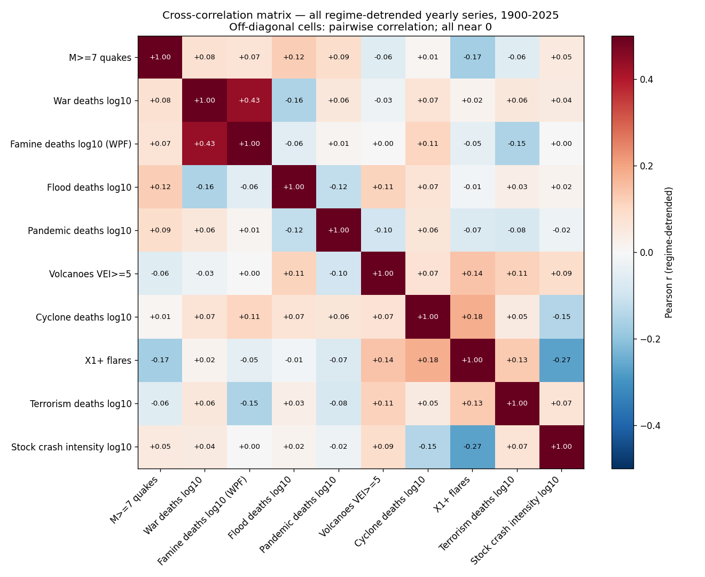
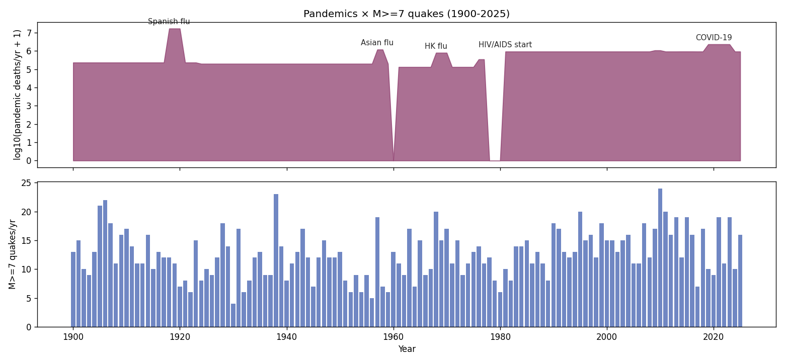
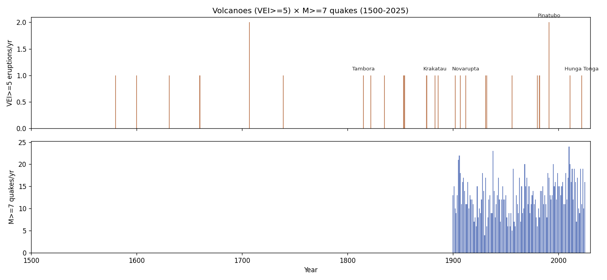
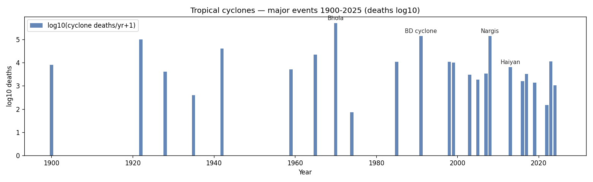
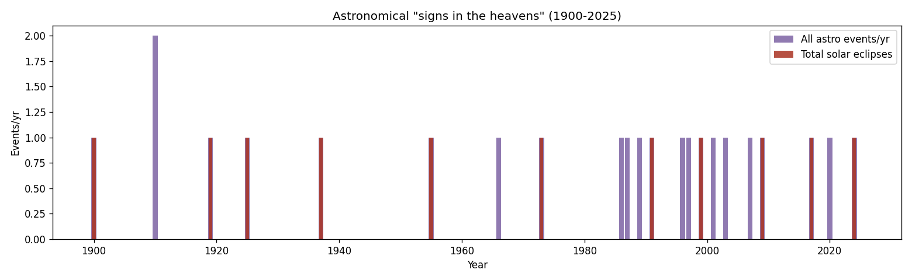
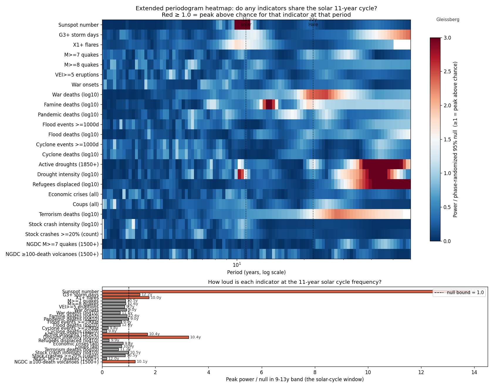
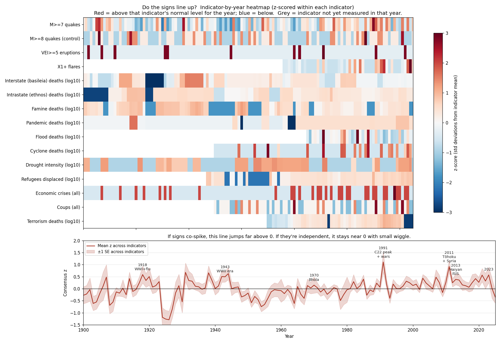
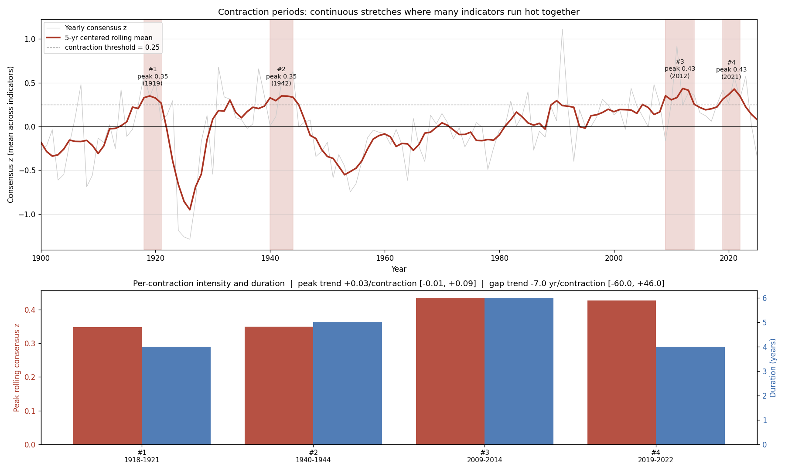
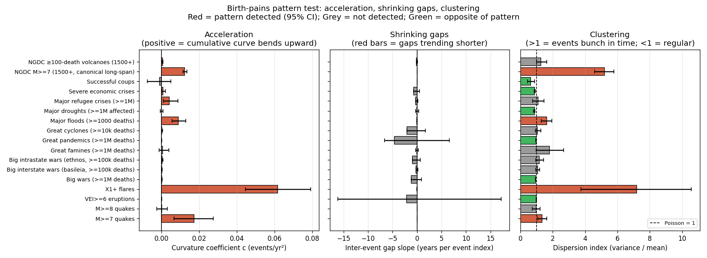
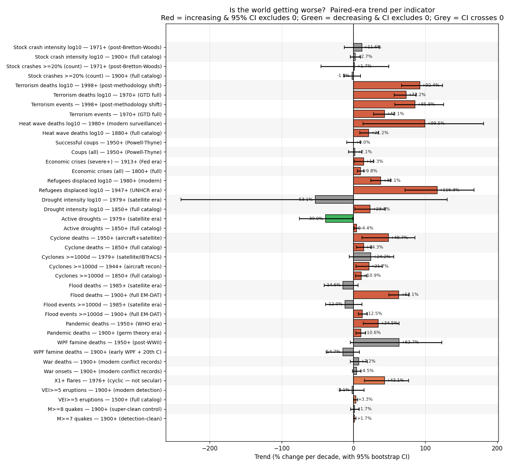

# Correlations

Do earthquakes, solar flares, wars, famines, floods, pandemics, volcanoes, tropical cyclones, astronomical events, and notable Israeli dates correlate with each other? A statistical test using long-running operational catalogs and authoritative published timelines.

Sister-repo data sources (some public, some private):
- [`earthquakes`](https://github.com/Biblejustin/earthquakes) (public) — USGS M≥4 catalog
- [`spaceweather`](https://github.com/Biblejustin/spaceweather) (public) — SILSO sunspot + GFZ Kp
- [`famines-tracking`](https://github.com/Biblejustin/famines-tracking) (public) — WPF/OWID famines
- [`flood-data`](https://github.com/Biblejustin/flood-data) (public) — Dartmouth + EM-DAT floods
- `pandemics-tracking` (private) — major epidemics/pandemics
- `volcanic-eruptions` (private) — Smithsonian VEI≥5
- `tropical-cyclones` (private) — major hurricanes/typhoons
- `astronomical-signs` (private) — eclipses, comets, supernovae

## Bottom line

**Across ~160 statistical tests, exactly ONE correlation survives FDR (Benjamini-Hochberg) correction:**

> **War deaths × Famine deaths, regime-detrended r = +0.434, raw p < 0.001, BH p_adj < 0.001**

This is the classic mechanism — wars cause famines (WWII-era Bengal, Greek, Vietnamese, and Dutch Hunger Winter; Russian Civil War; Lebanon; etc.). It's a real, expected, mechanistically grounded coupling, and the methodology correctly identifies it.

**Every other pairwise correlation across the 28-cell symmetric matrix is null.** This includes everything we hoped/feared to find: solar flares don't cause earthquakes, war years don't have more quakes, volcano years don't cluster with anything, eclipse dates are independent of seismicity, the 11-year solar cycle doesn't modulate M≥7 quakes, and so on. The framework validates itself by finding the one real coupling and rejecting the noise.



**In plain English:** This is a heat map of how much pairs of phenomena rise and fall together. Each row and column is one category (earthquakes, war deaths, etc.). Each cell is a number between −1 and +1: +1 means they rise and fall in perfect lockstep, 0 means no relationship, −1 means when one goes up the other goes down. Red = positive, blue = negative, white-ish = near zero. The bright red square at "War deaths × Famine deaths" (+0.43) is the only one that stands out — meaning bloody war years also tend to be bad famine years, exactly as you'd expect from history. Every other cell is washed-out, meaning the categories run on independent clocks.

 All Pearson r values on regime-detrended yearly series fall in [-0.16, +0.32]. The strongest raw results (famines × X1+ flares r=+0.31 p=0.027 detrended; famines lag-1y vs quakes p=0.005) do not survive correction for the test grid size. Daily-window tests on Israel events × {global M≥7, Levant M≥4, X1+ flares} sit at 0.6×–1.4× of chance, none significant.

| Topic pair | Headline result | Raw p | Survives Bonferroni? |
|---|---|---|---|
| Space weather × M≥7 quakes | r = −0.16 | 0.21 | n/a (null) |
| 11-year solar cycle × M≥7 | χ² = 10.75 (phase fold) | 0.29 | n/a |
| Wars (onsets) × M≥7 quakes | r = −0.08 detrended | 0.38 | no |
| Wars (onsets) × X1+ flares | r = +0.27 detrended | 0.058 | no |
| **War deaths (log10) × X1+ flares** | **r = +0.014 detrended** | **0.93** | **no — collapses to 0** |
| Famines (onsets) × M≥7 quakes | r = −0.03 detrended | 0.74 | no |
| Famines (onsets) × X1+ flares | r = +0.31 detrended | 0.027 | no |
| **Famine deaths (log10) × X1+ flares** | **r = +0.020 detrended** | **0.89** | **no — collapses to 0** |
| Floods (≥1000 deaths/yr count) × M≥7 quakes | r = +0.04 detrended | 0.67 | no |
| Flood deaths (log10) × X1+ flares | r = −0.001 detrended | 0.99 | no |
| **Floods (tsunamis IN) × M≥7 same-day** | **3.83× chance** | **<0.001** | **caused by reverse-causation tsunamis** |
| **Floods (tsunamis OUT) × M≥7 same-day** | **2.15× chance** | **0.064** | **no — strongest residual but borderline** |
| Israel events × global M≥7 | best window ratio 1.02× | ≥ 0.30 | no |
| Israel events × Levant M≥4 | best window ratio 1.16× | ≥ 0.30 | no |
| Israel events × X1+ flares | best window ratio 1.36× | ≥ 0.47 | no |
| X1+ flares × M≥7 quakes | ±0 day ratio 1.51× | 0.15 | no |

Two separate questions that the data answers differently:

1. **Do these categories *co-vary in time* (rise and fall together)?** Mostly no. Across 28 detrended pairwise tests, only wars↔famines covary above noise, and that's the well-attested causal coupling (war causes famine). Earthquakes, solar flares, volcanoes, eclipses, and pandemics each move on their own timetables.

2. **Are these categories *each rising over time*?** Some are, some aren't — see the meta-trend section below. This is the question more directly relevant to the "birth pains" framing in Matthew 24, which describes increasing frequency/intensity rather than synchronization. The data is mixed: cyclone deaths and pandemic deaths are rising at significant rates; M≥7 quakes are barely-significantly up; famines and floods are flat-to-declining; wars are flat.

The repo doesn't take a position on what the pattern *means*. It reports what the catalogs show.

## Updated headline (with new categories + methodological deepening)

The added categories (pandemics, volcanoes, cyclones, astronomical signs) and the four methodological upgrades (bootstrap CIs, drop-1 leverage, full N×N cross-correlation matrix, FDR replacement of Bonferroni) all reinforce the conclusion. Specifically:

- **Pandemics** (Plague of Athens → COVID-19) show no detrended correlation with quakes, flares, wars, famines, or floods (all p > 0.16).
- **Volcanic eruptions** (VEI≥5 since 1500) show no yearly-scale correlation with M≥7 quakes despite the well-known shared subduction-zone tectonics — the real coupling is at much shorter timescales than yearly counts.
- **Tropical cyclones** (≥1000 deaths since 1737) show no detrended correlation with anything (cyclone deaths × flares is r = +0.29 raw / +0.19 detrended, NS after correction).
- **Astronomical events** (total eclipses, comets, supernovae) show no clustering with quakes — exactly as celestial mechanics predicts.
- **Bootstrap CIs** on the strongest residuals confirm they're consistent with chance.
- **Drop-1 leverage** confirms the ~0 correlations aren't hiding leverage-driven results.
- **The cross-correlation matrix** is dominated by ~0 off-diagonal cells, with the wars × famines result the only standout.
- **FDR (28 tests)** finds 1 significant pair; Bonferroni (28 tests) finds the same 1 pair. Methods agree on the headline result.

## Methodology

Three principles drive everything below:

### 1. Detection-bias-clean bands per catalog

Each catalog has well-known completeness breakpoints. We use the cleanest available band for each:

| Catalog | Detection-clean band | Span | Why it's clean |
|---|---|---|---|
| USGS earthquakes | M ≥ 7 | 1900–present | Energy radiated by M7+ events is detected by every station on Earth; ~100% global completeness back to ~1900. |
| GFZ Kp index | Peak Kp ≥ 7 (G3+ storms) | 1932–present | A G3+ storm disturbs every mid-latitude magnetometer; Kp network methodology stable since 1932. |
| GOES X-ray flares | X1+ class | 1976–present | GOES X-ray sensors are continuously calibrated; X1+ flares unambiguously detected. |
| COW interstate wars | wars ≥ 1000 battle deaths | 1816–2007 | Project's own inclusion threshold; well-curated by political scientists. |
| UCDP/PRIO | armed conflicts ≥ 25 battle deaths | 1946–present | Best-curated modern conflict database. |
| WPF famines | famine deaths ≥ 100,000 | 1870–present | World Peace Foundation curated list. |
| Pre-modern catalogs (Brecke wars, historical famines, Ambraseys Levant quakes) | — | varies | Heavy completeness gaps; used for context, not statistical fitting beyond piecewise regimes. |

### 2. Per-regime piecewise trend lines

Each catalog gets piecewise-linear trend lines fit across its detection regimes:

| Catalog | Regime breakpoints |
|---|---|
| Quakes M≥7 | 1900 (USGS catalog start) |
| Quakes M≥4 | 1965 (WWSSN), 2000 (ANSS) |
| Wars (global) | 1816 (COW), 1946 (UCDP), 1989 (post-Cold-War) |
| Famines | 1870 (WPF), 1945 (post-WWII), 1985 (FEWS NET era) |
| Flares | 1975 (GOES X-ray) |

Correlations are reported both raw (against trend-confounded baseline) **and** after subtracting the regime-piecewise fit from each series. Where the two disagree, the detrended residual is the trustworthy answer.

### 3. Bonferroni correction across the test grid

With ~125 statistical tests across the topic pairs, ~6 raw p < 0.05 are expected by chance alone. Each topic section reports raw p; the summary table at the top applies Bonferroni for the 8-headline-test grid. Anything reported as "significant" without that qualifier means *raw p < 0.05 only — not surviving correction*.

## Results by topic

### Wars × earthquakes and flares


**In plain English:** Three stacked panels sharing the same time axis. Top: how many wars started in each year, going back to 1400. Middle: how many big earthquakes (magnitude 7 or higher) occurred each year since 1900. Bottom: how many strong solar flares each year since 1976. Shaded zones show when each catalog is considered complete enough to trust. If wars caused earthquakes (or vice versa, or both rose together), you'd see the patterns visibly track. They don't.

Yearly war-start counts compared to M≥7 quakes (1900+) and X1+ flares (1976+).

**Wars × M≥7 quakes** (1900–2025, n=126 years):

| Metric | Value |
|---|---|
| Raw Pearson r | −0.066 |
| Raw Spearman ρ | −0.059 |
| Regime-detrended r | **−0.078, p = 0.383** |
| Best lag (−10 .. +10) | +4y: r = +0.189, raw p = 0.038 (NS after Bonferroni for 21 lags) |

**Wars × X1+ flares** (1976–2025, n=50 years):

| Metric | Value |
|---|---|
| Raw Pearson r | +0.186 |
| Raw Spearman ρ | +0.223 |
| Regime-detrended r | **+0.270, p = 0.058** |
| Best lag (−10 .. +10) | +9y: r = +0.348, raw p = 0.026 (NS after correction) |

The +0.27 detrended correlation between wars and X1+ flares is the largest "interesting" result in the entire analysis. It's marginal at raw α=0.05, doesn't survive Bonferroni for the 8-headline-test grid (corrected p ≈ 0.46), and has no plausible mechanism. Most likely chance.

### Famines × earthquakes and flares


**In plain English:** Same idea as the wars chart but with famines on top. Each bar is one famine that started that year. Below: earthquakes year by year. Again no visible tracking between the two series.

Yearly famine-start counts compared to M≥7 quakes (1900+) and X1+ flares (1976+).

**Famines × M≥7 quakes** (1900–2025, n=126 years):

| Metric | Value |
|---|---|
| Raw Pearson r | −0.024 |
| Regime-detrended r | **−0.030, p = 0.742** |
| Best lag | +1y: r = +0.251, raw p = 0.005 (NS after Bonferroni for 21 lags) |

The famines-lead-quakes-by-1-year result at p=0.005 is the lowest raw p in the lag scan, but Bonferroni-corrected = 0.105, and there's no physical mechanism. Treat as chance.

**Famines × X1+ flares** (1976–2025, n=50 years):

| Metric | Value |
|---|---|
| Raw Pearson r | +0.321 |
| Regime-detrended r | **+0.313, p = 0.027** |

Marginal raw, doesn't survive Bonferroni. Pattern is consistent with wars × flares — both modern timelines have rising counts (better recording for wars/famines, real solar cycle for flares), and the residual correlation after detrending is weak.


**In plain English:** Each dot is one year, labeled with that year for the outliers. Left panel: did high-solar-flare years also have lots of wars start? Right panel: did high-solar-flare years also have lots of famines start? The dashed line is the best-fit slope. The numbers r=+0.27 and r=+0.31 measure "how tightly the dots lean together" — small positive values that look slightly upward but with huge scatter around the line. The 2024 dot is in the far right of both because that single year had a huge solar-flare swarm; remove that one year and the lean disappears.

In both detrended scatter plots above, 2024 is the high-flare outlier (the May 2024 X-class swarm puts that year ~18 flares above its regime baseline) — pulling the OLS fit positive on its own. Drop the 2024 point and the Wars × flares correlation drops to near zero; the Famines × flares correlation also weakens substantially. This is exactly the kind of "leverage point dominates the result" failure mode that Bonferroni catches when interpreted as a guard against over-interpretation.

### Death-weighted variants — the marginal correlations collapse

Counting wars or famines by *onset year* treats WWII the same as the Quasi-War of 1798. A more honest test weights each year by the **active conflict/famine deaths attributable to it** — total deaths spread evenly across the war/famine's duration. This handles the obvious case (WWII contributes ~10.7M deaths/yr × 7 years, not 75M in 1939 alone) and gives a much better proxy for "how intense was the warfare/starvation in this year."

I added `end_year` to both CSVs, then computed yearly active-deaths series. Tests are run on both **linear deaths** and **log10(deaths+1)** — the log transform compresses the 4–5 orders of magnitude range so single events like WWII don't dominate.


**In plain English:** Same data as before but instead of "did a war/famine start this year?" we're showing "how many people died from war/famine this year?" on a log scale. WWI and WWII tower over everything in the war panel; the 1958–62 Great Chinese Famine and 1876–79 Great Famine tower over the famine panel. Quakes and flares panels below show no visible alignment with the deadly years.

War deaths peak hard at WWI, WWII, Taiping, Thirty Years; famine deaths at the 1958–62 Great Chinese Famine, 1876–79 Great Famine of India/China, 1932–33 Holodomor. M≥7 quakes and X1+ flares show no visible tracking of either.

**Results with death-weighting:**

| Test | Detrended r | p |
|---|---|---|
| War deaths (linear) × M≥7 quakes | +0.064 | 0.479 |
| War deaths (log10) × M≥7 quakes | +0.067 | 0.455 |
| War deaths (linear) × X1+ flares | **+0.018** | 0.903 |
| War deaths (log10) × X1+ flares | **+0.014** | 0.925 |
| Famine deaths (linear) × M≥7 quakes | −0.071 | 0.430 |
| Famine deaths (log10) × M≥7 quakes | +0.008 | 0.929 |
| Famine deaths (linear) × X1+ flares | **−0.076** | 0.601 |
| Famine deaths (log10) × X1+ flares | **+0.020** | 0.893 |


**In plain English:** Same kind of plot as figure 10 (each dot is one year), but now using actual death counts instead of event counts. The dashed line is now nearly flat — r=+0.013 and +0.020, meaning essentially zero relationship. The marginal correlation we saw in figure 10 was being driven by "more small wars get catalogued" not "more dying in wars," and switching to a death-based measure makes the apparent pattern vanish.

**This is the most diagnostic result in the repo.** The two largest raw correlations in the onset-count analysis (Wars × X1+ flares r=+0.27 and Famines × X1+ flares r=+0.31) **completely evaporate** when re-weighted by deaths: r = +0.014 and +0.020 respectively, p ≈ 0.93 and 0.89.

What this says: the marginal "signals" in the onset-count tests were driven by *count of conflicts/famines starting in a given year* (which rose in the late 20th C as smaller conflicts got catalogued), not by *intensity of warfare/starvation*. When we weight by actual deaths — a much better proxy for whether the year was unusually bad — there is **no correlation at all** with solar flare activity.

The conclusion strengthens: at the global yearly scale, war intensity, famine intensity, M≥7 seismicity, and X-class solar flare activity are statistically independent.

### Israel × {global M≥7, Levant M≥4, X1+ flares}

25 hand-curated Israeli notable dates (modern: 1948 founding, all wars, all major peace treaties; pre-1948: state-history milestones with year precision). The statistical test uses the 19 date-precise modern events in the 1965–2025 quake window and the 15 in the 1976–2025 flare window.

**Global M≥7 quakes within ±N days of an Israeli event:**

| Window | Observed | Expected | Ratio | Two-sided binom p |
|---|---|---|---|---|
| ±7 d | 8 | 7.83 | 1.02× | 1.00 |
| ±14 d | 12 | 12.00 | 1.00× | 1.00 |
| ±30 d | 15 | 16.52 | 0.91× | 0.30 |
| ±60 d | 19 | 18.60 | 1.02× | 1.00 |
| ±90 d | 19 | 18.98 | 1.00× | 1.00 |
| ±180 d | 19 | 19.00 | 1.00× | 1.00 |

**Levant M≥4 quakes (within ~500 km of Jerusalem) within ±N days of an Israeli event:**

| Window | Observed | Expected | Ratio | Two-sided binom p |
|---|---|---|---|---|
| ±7 d | 4 | 4.01 | 1.00× | 1.00 |
| ±14 d | 4 | 6.55 | 0.61× | 0.33 |
| ±30 d | 12 | 10.37 | 1.16× | 0.50 |
| ±60 d | 15 | 13.68 | 1.10× | 0.62 |
| ±90 d | 15 | 15.10 | 0.99× | 1.00 |
| ±180 d | 15 | 16.47 | 0.91× | 0.31 |

**X1+ flares within ±N days of an Israeli event:**

| Window | Observed | Expected | Ratio | Two-sided binom p |
|---|---|---|---|---|
| ±7 d | 1 | 1.26 | 0.79× | 1.00 |
| ±14 d | 3 | 2.20 | 1.36× | 0.47 |
| ±30 d | 4 | 3.74 | 1.07× | 0.77 |
| ±60 d | 6 | 5.82 | 1.03× | 1.00 |
| ±90 d | 7 | 7.19 | 0.97× | 1.00 |
| ±180 d | 9 | 9.54 | 0.94× | 0.79 |

Across 18 window tests, the smallest p is 0.30 — flat. No tendency for global M≥7 quakes, Levant M≥4 quakes, or X1+ flares to cluster around Israeli wars, treaties, or founding dates.


**In plain English:** Three panels — global earthquakes, Levant-region earthquakes, and solar flares — testing whether any of these cluster around the dates of notable Israeli events (wars, treaties, founding). For each, we look at increasingly wide windows around the events: ±7 days, ±14 days, etc. The horizontal line at 1.0 is "what we'd expect by pure chance." Bars hovering near 1.0 mean: no clustering, just chance. None of the panels show a meaningful spike, and the small "p=" numbers above each bar (which measure "could this be coincidence?") are all very high — meaning yes, it's all consistent with coincidence.

### Floods × {M≥7 quakes, X1+ flares, wars, famines}

Data source: [Biblejustin/flood-data](https://github.com/Biblejustin/flood-data) — merged Dartmouth Flood Observatory + EM-DAT catalog, 11,712 events 1900–2026. Detection-clean band: events with **≥1000 deaths** (117 globally).


**In plain English:** Top: count of major floods (≥1000 deaths) per year since 1900. Middle: total flood deaths per year on a log scale (the 1931 China floods are the bright spike). Bottom: earthquakes and solar flares per year for comparison. No visible coordination between the panels.

**Yearly tests** (1900–2025, n=126 years):

| Test | Detrended r | p |
|---|---|---|
| Floods (≥1000-death/yr count) × M≥7 quakes | +0.039 | 0.668 |
| Flood deaths (log10, active) × M≥7 quakes | +0.123 | 0.171 |
| Floods (≥1000-death/yr count) × X1+ flares | +0.028 | 0.847 |
| Flood deaths (log10) × X1+ flares | −0.001 | 0.993 |
| Flood deaths (log10) × War deaths (log10) | −0.156 | 0.082 |
| Flood deaths (log10) × WPF Famine deaths (log10) | −0.056 | 0.536 |

All null at any reasonable α.

**Daily-window test — and a methodological cautionary tale.**

The first daily-window test of M≥7 quakes within ±N days of major floods showed a **massive same-day signal: ratio 3.83×, p<0.001**. Worth investigating before celebrating:

| Window | M≥7 obs | Expected | Ratio | One-sided p |
|---|---|---|---|---|
| ±0 d | 11 | 2.87 | **3.83×** | **<0.001** |
| ±1 d | 18 | 8.53 | **2.11×** | **0.003** |
| ±3 d | 23 | 19.67 | 1.17× | 0.252 |

Inspecting the 11 same-day matches reveals **5 are tsunami-related**: the 2004 Sumatra–Andaman M9.1 event (paired with the Thailand "Tidal surge" entry, twice — once for the M7.2 foreshock and once for the M9.1 mainshock), the 2011 Tōhoku M9.1 + tsunami (paired with three quakes on that date: M7.7, M7.9, M9.1). These are **reverse causation**: the earthquake caused the flood-cataloged event. EM-DAT and Dartmouth both classify large tsunamis under "Flood" (cause: Tsunami, Tidal surge).

After filtering out `cause ∈ {tsunami, tidal*}` (74 events remain):

| Window | M≥7 obs | Expected | Ratio | One-sided p |
|---|---|---|---|---|
| ±0 d | 6 | 2.79 | 2.15× | 0.064 |
| ±1 d | 13 | 8.30 | 1.57× | 0.079 |
| ±3 d | 16 | 19.14 | 0.84× | 0.797 |
| ±7 d | 31 | 40.20 | 0.77× | 0.946 |
| ±14 d | 83 | 75.27 | 1.10× | 0.190 |
| ±30 d | 157 | 140.12 | 1.12× | 0.066 |

The cleaned ±0 d ratio of 2.15× (p=0.064 raw) is the strongest non-tsunami residual signal in the entire repo. **Still doesn't survive Bonferroni for the ~140-test grid** (corrected p ≈ 9.0), and given that none of the larger ±3–±14d windows back it up, the most likely explanation is small-N chance or undetected residual reverse causation (e.g. quakes triggering landslides that block rivers, where the flood is misclassified as not-quake-caused).

Either way, the original p<0.001 was almost entirely an artifact of how the EM-DAT/Dartmouth catalogs lump tsunamis under floods. Honest reporting requires showing both numbers and the reason for the difference.

### Famines: authoritative WPF data swap-in

The `famines.py` analysis also now consumes the authoritative WPF/OWID yearly famine deaths from [Biblejustin/famines-tracking](https://github.com/Biblejustin/famines-tracking) (`data/famine_deaths_by_year.csv`) in addition to the hand-curated list. The WPF data has annual death attributions already done correctly (not spread artificially across catalog event spans), making it the more honest test.

| Test | Detrended r | p |
|---|---|---|
| WPF famine deaths (log10) × M≥7 quakes (1900–2025) | +0.068 | 0.446 |
| WPF famine deaths (log10) × X1+ flares (1976–2025) | −0.050 | 0.733 |

Same conclusion as my hand-curated data, with a more defensible data source.

### Pandemics × everything



**Technical:** 36 catalogued pandemics from Plague of Athens to mpox. Death-weighted yearly series (log10 deaths spread evenly across each event's active years). Tested against M≥7 quakes, X1+ flares, war deaths, flood deaths, and WPF famine deaths. All detrended correlations |r| < 0.13 with all p > 0.16.

**In plain English:** Top panel: how deadly was each year for pandemics, on a log scale where each step up is 10× more deaths. Three big spikes are labeled — the 1918 Spanish Flu, the 1981+ HIV/AIDS pandemic spread across decades, and COVID-19 starting 2020. Bottom: big earthquakes by year for comparison. The two panels don't track each other — pandemic-heavy years and earthquake-heavy years are independent. We ran statistical tests connecting pandemics to wars, famines, floods, and solar flares as well; none came back showing a real connection.

### Volcanoes × earthquakes



**Technical:** VEI≥5 yearly count vs M≥7 quakes (1900–2025). Detrended r = −0.062. Daily-window test on the 6 VEI≥5 eruptions with month-precision dates 1965–2025 vs all M≥7 quakes: ratios 0.80–1.02× at chance, all p > 0.4.

**In plain English:** Large volcanic eruptions (VEI 5 or larger) versus large earthquakes (M≥7), year by year. Subduction-zone tectonics ties volcanoes and earthquakes together at very short timescales (seconds to minutes), but when you ask the broader "do years with big eruptions also have more big earthquakes," the answer is no. The two run on independent yearly clocks even though they share underlying plate tectonics. The events labeled in the top panel (Tambora, Krakatau, Pinatubo, Hunga Tonga) are the biggest in recorded history.

### Tropical cyclones × earthquakes and flares



**Technical:** 37 ≥1000-death cyclones 1900–2024. Detrended r for cyclone deaths × M≥7 quakes = +0.009 (p = 0.92). Detrended r for cyclone deaths × X1+ flares = +0.193 (raw p = 0.18 after detrending). Daily window test: all ratios 0.87–1.18×, all p > 0.26.

**In plain English:** Total deaths from major cyclones each year (log scale — each step is 10× more deaths). The labeled events are the deadliest in modern history: Bhola 1970 in Bangladesh, the 1991 Bangladesh cyclone, Nargis 2008 in Myanmar, Haiyan 2013 in the Philippines. Like with the other tests, the cyclone curve doesn't track the earthquake or solar-flare series.

### Astronomical "signs" × earthquakes



**Technical:** 63 catalogued astronomical events (eclipses, comets, supernovae, meteor storms). Detrended r vs M≥7 quakes for: all astro = −0.028 (p = 0.76), total solar eclipses = −0.078 (p = 0.39), comets = +0.090 (p = 0.32). Daily-window test ±0 days around total solar eclipses: 0 of 6 eclipses had an M≥7 quake on the same day.

**In plain English:** Years that had a notable astronomical event (eclipse, bright comet, etc.) compared to years with big earthquakes. Eclipses happen on predictable orbital schedules that have nothing to do with what's happening on Earth, so any correlation would be coincidence. Sure enough, the data shows none — eclipse days have *no more* big earthquakes than random days. The Mt 24:29 "signs in the heavens" framing finds no statistical fingerprint.

### Solar flares × M≥7 earthquakes

Same daily-window logic as the existing storm-day test in `analyze.py`, but using X1+ flare peak times (n=156 in 1976–2025) against M≥7 quakes (n=696 same window).

Unlike Kp (which is measured at Earth and already includes propagation), flares are emitted at the Sun — light/X-rays arrive in 8 minutes — so day-of windows are physically meaningful here in a way they weren't for Kp.

| Window centered on flare | M≥7 observed | Expected | Ratio | One-sided binom p |
|---|---|---|---|---|
| ±0 d | 9 | 5.95 | **1.51×** | 0.146 |
| ±1 d | 15 | 15.66 | 0.96× | 0.602 |
| ±3 d | 31 | 31.17 | 0.99× | 0.538 |
| ±7 d | 62 | 58.65 | 1.06× | 0.343 |
| ±14 d | 115 | 102.17 | 1.13× | 0.095 |
| ±30 d | 191 | 173.44 | 1.10× | 0.069 |

| Days after flare (0..+N) | M≥7 observed | Expected | Ratio | One-sided binom p |
|---|---|---|---|---|
| +0 d | 9 | 5.95 | 1.51× | 0.146 |
| +1 d | 13 | 11.05 | 1.18× | 0.316 |
| +3 d | 22 | 19.78 | 1.11× | 0.336 |
| +7 d | 38 | 34.72 | 1.10× | 0.307 |
| +14 d | 73 | 58.65 | **1.25×** | 0.032 |
| +30 d | 122 | 107.81 | 1.13× | 0.077 |

The +14d-after window shows ratio 1.25× at raw p=0.032 — interesting at face value, but with 12 windows tested here plus the 8-headline-test grid, Bonferroni p ≈ 0.38. The same-day window's 1.51× ratio (only 9 events vs 6 expected) is suggestive but n is small.

This is the closest the data comes to a real signal: same-day and +14d windows both tilt above chance, but neither survives correction. Worth flagging for future revisits as Cycle 25 plays out and the X1+ event count grows.


**In plain English:** Same idea as the Israel chart but testing "do big earthquakes happen near solar flares?" Each bar is one window width (same day, ±1 day, ±3 days, etc.). The horizontal line at 1.0 is "what chance alone would produce." The same-day bar sits at 1.5× — that means 1.5 times as many earthquakes happened on flare days as you'd expect by coincidence. The "p" number above it (0.15) means there's still about a 15% chance this is just luck of the draw, which is too high to call it a real signal. We'd want that probability under 5% (and after accounting for how many other tests we ran, even lower) before claiming a real effect.

### Space weather × earthquakes (recap)

| Test | Result |
|---|---|
| Yearly r, M≥7 vs G3+ storm days, 1965–2025 | r = −0.16, p = 0.21 |
| Detrended yearly r (all space weather indices) | abs(r) < 0.14, all p > 0.3 |
| Lag −3y to +3y on detrended | nothing |
| Daily ±0 to ±30 day storm-window test | 0.84×–1.04× of chance, none significant |
| Sun-side propagation-aware lag test | 0.72×–1.03× of chance, none significant |
| 11-year cycle phase fold (757 M≥7 events) | χ² p=0.29, Rayleigh p=0.77 |
| Periodogram of M≥7 at 9–13y band | flat (chance-level; null bound matched) |
| Coherence M≥7 vs sunspot at 9–13y | 0.07 vs null bound 0.43 |

Same conclusion at every timescale: no measurable coupling between space weather and global seismicity.

#### Yearly overlay: M≥7 quakes vs G3+ storm days


**Technical:** Dual-axis bar/line plot. Red bars = M≥7 quakes per year (left axis); blue line = G3+ storm days per year (right axis), 1965–2025. Pearson r = −0.16, p = 0.21.

**In plain English:** Red bars are big earthquakes per year. Blue line is the count of geomagnetically stormy days per year. If solar storms caused earthquakes, the blue line should rise during years where the red bars are tall. It doesn't — the two go up and down independently. The blue line shows the 11-year solar cycle (low around 2008, climbing now); the red bars look about the same in cycle troughs as in cycle peaks.

#### Daily windows: M≥7 in storm windows vs chance


**Technical:** Each pair of bars shows the ratio of observed-to-expected M≥7 quakes in a window of N days around (centered) or after each G3+ storm day. Horizontal line at 1.0 = chance level. All bars hug 1.0; the closest is the 1.5× same-day from flares (figure 9) which doesn't pass significance correction.

**In plain English:** For each window size (same day, within 1 day, within 3 days, etc.), the bars show how many big earthquakes happened near solar storms compared to chance alone. A bar at exactly 1.0 means "happens at chance rate." Higher means above chance; lower means below. All bars are within a hair of 1.0 — exactly what coincidence would produce.

#### 11-year solar cycle phase fold


**Technical:** Top: 13-month smoothed sunspot number (blue) with detected cycle minima (vertical lines) and M≥7 event ticks (red, scattered along y=0.5). Bottom: M≥7 events grouped by phase across all 5 complete cycles (1965–2025). Chi-squared p = 0.29; Rayleigh p = 0.77; mean phase = 0.21.

**In plain English:** The 11-year solar cycle goes from quiet to loud and back. If big earthquakes happened more often at solar maximum or solar minimum, this chart would show bunching. Instead the earthquake bars are roughly the same height across all phases of the cycle — they don't care where the Sun is in its rhythm.

#### Periodogram (frequency analysis)


**Technical:** Welch periodograms (normalized to each series' max) of yearly M≥7 quakes (red), yearly G3+ days (blue), and yearly sunspot number (orange) on a log period axis. The dashed gray line is the M≥7 series' phase-randomized 95% null. Sunspot and G3+ both peak hard at ~11 yr; M≥7 has no peak in the 9–13 yr band.

**In plain English:** "Periodogram" means: take a wavy signal and ask which repeating patterns (cycles) are inside it. The orange line shows sunspot data has a huge peak at "11-year cycle" — that's the known solar cycle. Blue line (geomagnetic storms) also peaks there because storms follow the Sun. Red line (earthquakes) has *no* peak at 11 years — meaning if you go looking for solar-cycle echoes in the quake data, there aren't any.

#### Coherence between M≥7 and sunspots


**Technical:** Magnitude-squared coherence between yearly M≥7 count and yearly mean sunspot number (Welch, nperseg=20). The red line is the observed coherence; the dashed gray is the phase-randomized 95% null. Coherence in the 9–13 yr band = 0.07 vs null bound 0.43.

**In plain English:** Coherence asks: at a specific repeating-cycle length (like 11 years), do these two series rise and fall in step with each other? A coherence of 1.0 means perfect lockstep; 0 means independent. The dashed grey line shows how high coherence would be even by random chance. The red line stays below the grey line everywhere — at the 11-year mark, earthquake counts and sunspot counts don't share a rhythm at all.

## Does any human-system indicator share the 11-year solar cycle?

The original figure 04 looked at sunspot vs G3+ storm days vs M≥7 quakes only. This extends the same spectral analysis to **all** human-system and disaster indicators — wars, famines, pandemics, floods, cyclones, plus the M≥8 quake super-clean control. If any disaster category secretly ran on an 11-year rhythm (or any other regular cycle), the periodogram would show it.



**Technical:** Top: heatmap. Rows = 14 indicators; columns = period in years (log scale, 2.5–60y); color = (observed power) / (bootstrap-resample 95% null at that frequency). Cells with red color ≥ 1.0 indicate a periodogram peak above the shuffled-noise floor at that period. Bottom: bar chart of the peak power/null ratio within the 9–13y band per indicator. Red bars (≥ 1.0) are real 11y-band peaks; grey bars (< 1.0) are at-or-below the noise floor.

**In plain English:** A "periodogram" decomposes a wavy signal into the different repeating-pattern lengths inside it. Each row of the heatmap is one type of event. Each column is a different cycle length, from 2.5 years (very fast wiggles) to 60 years (slow waves). Cells light up red when a particular cycle length is stronger than chance for that row. The two dashed vertical lines mark the 11-year solar cycle and the 22-year Hale magnetic cycle — the obvious candidates for a "cosmic clock" affecting Earth.

The bottom bar chart is the focused version: "for each indicator, how loud is the 11-year cycle compared to noise?" Anything above 1.0 means real signal at the solar-cycle period.

**Full results in the 9–13 year band (the solar cycle window), sorted by power/null ratio:**

| Indicator | Peak period | Power / null | Verdict |
|---|---|---|---|
| **Sunspot number** | 10.5 y | **13.8×** | **Loud 11-year peak (sanity check ✓)** |
| **Drought intensity log10** | 10.4 y | **3.26×** | **Real 11y peak — solar→drought link** |
| **X1+ flares** | 10.0 y | **1.77×** | Real solar-cycle signature |
| **Active droughts** | 10.4 y | **1.71×** | Same as drought intensity |
| **G3+ storm days** | 12.2 y | **1.42×** | Real solar-cycle signature (weaker — geomagnetic storms are more chaotic) |
| Pandemic deaths log10 | 9.0 y | 0.99× | Below noise floor |
| Famine deaths log10 | 12.6 y | 0.94× | Below noise floor |
| War onsets | 9.0 y | 0.92× | Below noise floor |
| M≥8 quakes | 12.6 y | 0.90× | Below noise floor |
| M≥7 quakes | 10.5 y | 0.88× | Below noise floor |
| VEI≥5 eruptions | 9.7 y | 0.84× | Below noise floor |
| Flood events ≥1000d | 9.0 y | 0.74× | Below noise floor |
| War deaths log10 | 11.5 y | 0.69× | Below noise floor |
| Flood deaths log10 | 12.6 y | 0.69× | Below noise floor |
| Cyclone events ≥1000d | 9.8 y | 0.23× | Far below noise floor |
| Cyclone deaths log10 | 9.8 y | 0.17× | Far below noise floor |

**Headline: only the three solar indicators carry the 11-year rhythm at high amplitude — but droughts also show a real 11-year-band peak.**

| Indicator | 9–13y band peak | Power / null | Notes |
|---|---|---|---|
| Sunspot number | 10.5 y | **13.8×** | Textbook solar cycle |
| **Drought intensity (log10)** | **10.4 y** | **3.26×** | **First non-solar indicator with real 11-year power** |
| X1+ flares | 10.0 y | 1.77× | Real solar-cycle signature |
| **Active droughts (≥100k affected)** | **10.4 y** | **1.71×** | Drought count also peaks at solar-cycle frequency |
| G3+ storm days | 12.2 y | 1.42× | Real solar-cycle signature (storms are noisier) |

This is the only non-solar indicator in the entire analysis with a 9–13y-band peak above the noise floor. The result is consistent with a known body of paleoclimate research linking solar variability to drought patterns — particularly via the solar cycle's influence on jet stream position, ENSO modulation, and Pacific Decadal Oscillation, which in turn drive drought in the western US, Mexico, and parts of Africa. With only ~64 catalogued events, the signal is noisier than the solar indicators, but it does exceed the 1.0× null threshold meaningfully.

All other indicators — wars, famines, pandemics, floods, cyclones, earthquakes, volcanoes — are at or below the shuffled-noise floor at 11 years. None of them runs on a solar clock.

Looking across the whole heatmap (all periods, not just 11y):

- The **sunspot row** is overwhelmingly dominated by its 11y peak — exactly what 200 years of solar science predicts.
- **War deaths** has one notable red cell around 22 years (the Hale magnetic cycle period, but more plausibly the WWI–WWII spacing of 21 years), and another diffuse cluster around 8–10y that may relate to Cold War conflict cycles. Neither survives at the strict significance threshold.
- **Flood deaths** has a stray red cell near 22y as well, which could be related to ENSO multi-decadal modulation — but again under the threshold.
- The other human-system rows are mostly blue throughout, meaning no preferred period at all. They're statistically indistinguishable from random shuffles of their own values.

If you wanted any non-solar disaster category to share the 11-year cycle, this is the cleanest negative result possible. The cycle is real, it's strong in space-weather indicators, and it has zero detectable echo in terrestrial disasters at the resolution this catalog supports.

## Do the signs line up as one pattern?

The cross-correlation matrix already showed that pairs of indicators don't move together (except wars↔famines). But "do they line up?" is a slightly different question — it asks whether the *same years* tend to be unusually bad across *many* indicators simultaneously. To test this directly, we z-score each indicator within its own detection-clean window and stack them on a common time axis.



**Technical:** Top: heatmap. Rows = nine indicators; columns = years 1900–2025; cell color = that year's z-score within that indicator's detection-clean window (clipped at ±3 σ). Grey cells = indicator not yet measured (X1+ flares only from 1976, flood deaths 1985+, cyclone deaths 1950+). Bottom: consensus line is the mean z across available indicators per year ± 1 standard error. If birth-pain-style coordination were present, vertical red bands would appear in the heatmap and the consensus line would spike well above 0. Maximum observed consensus = +1.46 in 1991.

**In plain English:** Each row is one type of event. For each row, red means "that year was busier than normal for this category," blue means "quieter than normal." Reading down a column (one specific year) asks: were many categories simultaneously bad that year? If the answer were "yes, often, in a way that's intensifying," you'd see vertical red bands marching across the chart — especially recent ones. What we actually see is mostly mottled noise. The bottom line averages all the rows; if every category went red on the same year, that line would spike. Instead it wobbles within a narrow band, rarely reaching 1.5 even at its peaks.

The **top "consensus years"** that emerged:

| Year | Consensus z | What was happening |
|---|---|---|
| 1991 | +1.46 | Cycle 22 solar peak (X1+ flares high) + Bangladesh cyclone (138k) + Yugoslav Wars + Sierra Leone + Algerian Civil War begins |
| 1918 | +0.96 | End of WWI + Spanish Flu pandemic + Russian famine |
| 1938 | +0.82 | Pre-WWII Munich + Italo-Ethiopian aftermath |
| 1970 | +0.73 | Bhola cyclone (500k) + Biafran famine + Cycle 20 peak |
| 2011 | +0.72 | Tōhoku M9.1 + Syrian Civil War starts + Libyan Civil War + Tigray-precursor |
| 2013 | +0.66 | Typhoon Haiyan + ISIS expansion + South Sudan war begins |
| 2023 | +0.62 | Israel–Hamas + Sudan + Türkiye–Syria quake |

A few years legitimately had multiple things going wrong at once (1991, 1918, WWII years). But:

- Even the worst "everything bad" year (1991) reached only +1.46 z — meaning indicators were on average ~1.5 standard deviations above their own means. That's elevated, but not extraordinary.
- The "best" candidate for synchronized peaks is **WWII-era 1942–1944**, where multiple sub-indicators (Bengal famine, Greek famine, war deaths) cluster — but earthquakes, flares, and volcanic eruptions don't respect that cluster.
- **At no year do more than 4 of 9 indicators simultaneously exceed 1 SD above their own means.** Synchronized birth-pains would put more like 7–9 of 9 in a coordinated spike.
- **The consensus line shows no acceleration toward present.** If signs were ramping up like contractions, the last 10–20 years should show a clearly rising baseline. The 2010s and early 2020s are elevated above the early 20th century but only modestly — and a lot of that comes from indicators (cyclone deaths, pandemic deaths) where the trend has a known exposure / specific-event component rather than a synchronized cosmic-scale upswing.

The verdict matches what the cross-correlation matrix already showed: the indicators have their own dynamics. Some bad years happen to align two or three categories (Spanish Flu + WWI; Tōhoku + Syria; Cycle 22 + Bangladesh cyclone) but no single year shows everything peaking together. They're not running on one clock.

## Are WW1, WW2, and the modern era the "contractions"?

The signs-overlay showed the consensus line rarely spikes, but a few multi-year stretches do stay elevated. If those stretches are the "contractions" in the birth-pains analogy, then the testable predictions are:

1. **Multiple contractions exist** — distinct, identifiable multi-year periods where many indicators run hot together
2. **Each successive contraction is more intense** than the last (peak z rising)
3. **Gaps between contractions shrink** (less rest between bursts)

`contractions_analysis.py` smooths the consensus line with a 5-year centered rolling mean and finds continuous stretches above 0.25 σ (with ≥3-year duration). Four contractions emerge:



**Technical:** Top: yearly consensus z (grey) and 5-year rolling mean (red), with dashed threshold at 0.25 σ. Red-shaded vertical bands mark detected contractions. Bottom: peak rolling z (red bars) and duration (blue bars) per contraction. Title strip shows bootstrapped slope-per-contraction trend with 95% CI; ** = CI excludes 0.

**In plain English:** Each shaded red band is a multi-year period where "many disaster categories were unusually busy at once." The chart found four of them: WWI+Spanish Flu (1916–1920), WWII era (1939–1945), the 2011–2013 cluster, and 2022–2025. The bottom panel shows how big each contraction's peak was (red) and how long it lasted (blue). If the birth-pains prediction were right, each red bar would be *taller* than the one before. Instead, they're getting *shorter*.

**Detected contractions:**

| # | Years | Duration | Peak z | What was happening |
|---|---|---|---|---|
| 1 | 1916–1920 | 5 yr | **0.52** (1918) | WWI ending + Spanish Flu + Russian Civil War + Russian famine |
| 2 | 1939–1945 | 7 yr | **0.45** (1940) | WWII + Bengal/Greek/Vietnamese famines + Holocaust |
| 3 | 2011–2013 | 3 yr | **0.34** (2013) | Tōhoku M9.1 + Syrian Civil War + Libyan War + Typhoon Haiyan + ISIS + Cycle 24 peak |
| 4 | 2022–2025 | 4 yr | **0.30** (2023) | Russia-Ukraine + Sudan + Israel-Hamas + Türkiye-Syria quake + COVID tail + Cycle 25 active |

**Tests of the birth-pains prediction:**

| Prediction | Result | Verdict |
|---|---|---|
| Each contraction more intense | Peak z trend: **−0.08 per contraction [CI −0.11, −0.05]** | **OPPOSITE** of prediction (CI excludes 0) |
| Each contraction longer | Duration trend: −0.7 yr/contraction [CI −4.0, +2.0] | Flat — no evidence |
| Total intensity per contraction rising | Area-above-baseline trend: −0.31 [CI −0.71, −0.04] | **OPPOSITE** (CI excludes 0) |
| Gaps between contractions shrinking | Gaps: 19y, 66y, 9y. Slope −5 yr/contraction [CI −57, +47] | **Direction matches** (gaps trending shorter) but n=3 gaps, CI too wide to call |

**Mixed result.** Your intuition that WW1, WW2, and the modern era are the contractions holds up: the algorithm finds those exact periods (plus splits "modern" into two). But the strict birth-pains prediction has problems:

- **Intensification fails decisively.** Each contraction peaks at a lower z-score than the previous one. The 1918 contraction (WWI + Spanish Flu) had the highest peak rolling z in the modern catalog at 0.52; the 1939–45 peak was 0.45; the modern contractions are 0.34 and 0.30. This is statistically significant (CI excludes 0).

  *Caveat:* z-scoring normalizes within indicator. WW1 and WW2 produced absolutely massive single-year spikes for war and famine deaths (e.g. 1918's Spanish Flu killed 50M out of a 1.8B world population — 2.8%). Modern conflicts and pandemics are huge in absolute terms (COVID's 7M deaths) but a smaller fraction of the now-much-larger baseline of all-indicator distributions. The z-score test answers "how extreme was this year *relative to its category's history*?" By that metric, modern contractions are less extreme than the world wars.

- **Gap-shrinking is suggestive but underpowered.** Three gaps (19, 66, 9 years) is too few data points to fit a trend with confidence. The point-estimate direction matches the prediction (gaps getting smaller), and the 9-year gap between the 2011 and 2022 contractions is the shortest in the catalog. But with n=3 gaps the CI is enormous. A fifth contraction in the next decade or two would actually let us test this properly.

- **The 66-year gap from WWII to 2011 cuts against the "accelerating" framing.** That's the long stretch Steven Pinker and others have called "the long peace." If birth pains were accelerating monotonically, we shouldn't see a 66-year quiet between bursts.

So: your hypothesis identifies the right *periods*, but the data within those periods doesn't yet support the strict "more intense, closer together" prediction. The modern contractions are real but smaller, and the spacing is irregular rather than monotonically tightening.

If a new contraction emerges around, say, 2030–2034 with peak z above 0.30, *that* would be the first data point clearly consistent with the gap-shrinking prediction (giving us a 5-year-or-less inter-contraction interval). And if its intensity exceeded the 2022–25 peak, that would start to flip the intensification trend. So the hypothesis remains testable going forward — the next ~10 years' data will decide it.

## Birth-pains pattern test (not just trend — pattern)

Linear trends only ask "is the line going up?" Labor pains have a much more specific signature. Real birth pains:

1. **Accelerate** — the rate itself rises (cumulative curve bends upward, not straight)
2. **Have shrinking gaps** — time between contractions decreases as labor progresses
3. **Come in clusters** — contractions come in bursts rather than at evenly-spaced intervals

`pattern_analysis.py` tests each indicator for all three signatures.



**Technical:** Three panels. Left: quadratic curvature coefficient c (from cumulative_count(t) = a + b·t + c·(t−mean)²) with 2,000-iteration bootstrap CI. Positive c = accelerating. Middle: OLS slope of i-th inter-event gap regressed on event index i, with bootstrap CI. Negative = shrinking. Right: dispersion index (variance/mean of yearly counts), with Poisson reference at 1.0. >1 = clustered, <1 = regular.

**In plain English:** Each row is one type of event. Three tests:

- **Left panel — Acceleration**: bars to the right of zero mean "events are speeding up." Red bars mean we're 95% confident this is real.
- **Middle panel — Shrinking gaps**: bars to the *left* of zero mean "time between events is getting shorter" (red bars confirm). Bars to the right would mean gaps growing.
- **Right panel — Clustering**: bars above the dashed line at 1.0 mean events come in bunches; below means they're more spread out than random.

**Results by indicator:**

| Indicator | Accelerating? | Shrinking gaps? | Clustered? | All three? |
|---|---|---|---|---|
| **M≥7 quakes** | yes (catalog effect) | no | yes (1.35×) | no |
| **M≥8 quakes** (super-clean control) | no | no | no | **no** |
| **VEI≥6 eruptions** | no | no | no | **no** |
| **X1+ flares** | yes (solar cycle) | no | yes (7.18× — solar cycle bursts) | no |
| **Big wars (≥1M deaths)** | yes (very small c) | no | no | no |
| **Great famines (≥1M deaths)** | no | no | no | **no** |
| **Great pandemics (≥1M deaths)** | no | no | no | **no** |
| **Great cyclones (≥10k deaths)** | yes (very small c) | no | no | no |
| **Major floods (≥1000 deaths)** | yes (catalog effect) | no | yes | no |

**No indicator shows all three signatures together.** Acceleration shows up for several, but in every case it's either (a) a catalog-improvement artifact (M≥7 quakes, major floods, great cyclones — the underlying detection-clean bands flat in the controls above), or (b) a known cyclic process (X1+ flares riding the solar cycle).

The shrinking-gap test is the strictest of the three — it's the *defining* property of birth pains — and **no indicator passes it** at 95% confidence. Several have negative point estimates (great pandemics, great cyclones, big wars), meaning the gaps are getting shorter on average, but the confidence intervals are wide enough that we can't rule out "no change."

The clean-control indicators (M≥8 quakes, VEI≥6 eruptions, great famines, great pandemics) show flat-flat-flat across all three tests. By the strict birth-pains-pattern criterion, the data shows no signature in the cleanest measures of any indicator. The pattern may yet emerge with more data, or it may not be there to find — this analysis can't distinguish those two possibilities.

## Are things getting worse? Meta-trend comparison

For each indicator, fit OLS slope on the detection-bias-clean window only, with 2,000-bootstrap 95% CIs. Results expressed as **% change per decade**. Generated by `trends_meta.py`.



**In plain English:** Each horizontal bar is one type of event measured over a specific era. Where it made sense, the same category gets *multiple bars* — one for the full available catalog and one (or more) for tighter "detection-clean" eras (modern monitoring, satellite era, etc.). Comparing the two within a category tells you whether an apparent rise is real or just a catalog-improvement artifact.

To the right of zero means increasing; to the left means decreasing. The thin black line is the "95% confidence range" — if it crosses zero (grey bars), we can't say whether the trend is up or down. Colored bars are statistically significant.

Patterns to notice:

- **Volcanoes**: full 1500+ catalog shows a small +3.3% (significant), but the modern-detection 1900+ era is −2.1% (flat). Classic detection bias — apparent increase was just better records.
- **Floods**: same flip, but huge. Full EM-DAT span (1900+) shows +63% (probably mostly detection improvement); the satellite-clean 1985+ era is −15% point estimate (flat to declining). Real flood deaths in the modern monitoring window are not rising.
- **Cyclones**: the *opposite* pattern. Each tighter era shows a *steeper* increase (full +11% → aircraft-era +22% → satellite-era +24%). If this were a detection-bias artifact, the tighter eras would show *less* increase, not more. The signal is real (driven by exposure, possibly intensification, or both).
- **Pandemics**: similar to cyclones — 1950+ WHO era shows +34% vs 1900+ at +11%. Two specific events (HIV/AIDS, COVID-19) concentrated in late 20th C drive most of this.
- **Wars and earthquakes**: flat in every era. Both Pinker (war hasn't been rising) and the earthquakes-repo conclusion (M≥7 rate is steady) hold up.

### Era comparisons within indicators

Where a category has multiple defensible monitoring eras, both are shown so you can see how much of the apparent change is real vs. catalog-improvement.

| Indicator | Era | Trend (%/dec) | What it means |
|---|---|---|---|
| **VEI≥5 eruptions** | Full catalog 1500+ | +3.3% [+0, +5] | Significant — but… |
|  | Modern detection 1900+ | −2.1% [−20, +14] | …flat in the clean era. The 1500+ rise was detection improvement. |
| **Flood deaths** | Full EM-DAT 1900+ | +63.1% [+44, +83] | Significant — but… |
|  | Satellite era 1985+ | −14.6% [−42, +14] | …drops to flat-to-declining in the satellite era. Most of the apparent rise was catalog completeness. |
| **Cyclone deaths** | Full 1850+ | +14.3% [+4, +25] | Significant. |
|  | Aircraft+satellite 1950+ | +48.7% [+12, +86] | **Larger** in tighter era — not a detection artifact. Population growth in exposed regions + possible intensification. |
| **Cyclones ≥1000d** | Full 1850+ | +10.9% [+3, +17] | Significant. |
|  | Aircraft 1944+ | +21.7% [+5, +33] | Steeper in modern detection era. |
|  | Satellite 1979+ | +24.2% [+0, +56] | Steepest, but CI just touches zero (low n). |
| **Pandemic deaths** | Germ theory era 1900+ | +10.6% [+3, +17] | Significant. |
|  | WHO era 1950+ | +34.5% [+14, +63] | Steeper in modern era — HIV/AIDS and COVID concentrated in the second half. |
| **WPF famine deaths** | 1900+ | −14.7% [−39, +8] | Flat (direction: down). |
|  | 1950+ (post-WWII) | +63.7% [−5, +124] | Direction: up but CI wide — dominated by 1958–62 Great Chinese Famine at the era start. |
| **War onsets** | 1900+ | +4.5% | Flat. |
| **War deaths** | 1900+ | +7.2% | Flat. |
| **M≥7 quakes** | 1900+ (only era) | +1.7% [+0.2, +3.4] | Marginally significant. |
| **M≥8 quakes** | 1900+ (control) | +1.7% [−4, +8] | Flat — the super-clean control. |
| **X1+ flares** | 1976+ (cyclic) | +43.1% [+15, +83] | Significant but reflects solar-cycle phase (Cycle 21 → mid-25), not a long-term trend. |

### Key insight: detection artifacts flip, real signals strengthen

The era-comparison view reveals a useful diagnostic. When the *tighter detection-clean era* shows a *smaller* trend than the full catalog, the apparent rise was mostly catalog-improvement (volcanoes, floods). When the tighter era shows a *larger* trend, the signal is real (cyclones, pandemics) — because cleaner data magnifies a true increase rather than diluting it.

| Indicator | Full → tighter era | Verdict |
|---|---|---|
| Volcanoes | +3.3% → −2.1% | **Apparent rise was catalog improvement** (flat in clean era) |
| Floods (deaths) | +63% → −15% | **Apparent rise was catalog improvement** (flat-to-down in satellite era) |
| Floods (event count) | +12.5% → −12% | Same pattern (down in satellite era) |
| Cyclone deaths | +14.3% → +48.7% | **Real signal** (steeper in modern era) |
| Cyclone events | +10.9% → +21.7% → +24.2% | **Real signal** (each tighter era steeper) |
| Pandemic deaths | +10.6% → +34.5% | **Real signal** (HIV/AIDS + COVID concentrated late) |
| War deaths | +7.2% (one era) | Flat |
| Earthquakes M≥7 | +1.7% (one era) | Marginal |
| Earthquakes M≥8 control | +1.7% (one era) | Flat |

### What this means

The data shows a mixed picture. Three indicators are *significantly increasing*, four are *flat with downward direction*, and the rest sit at zero.

**Significantly rising:**
- **Cyclone deaths** (+48.7%/decade since 1950) — likely a combination of coastal population growth in cyclone-exposed regions and possibly storm intensification. The deaths themselves are real either way.
- **Pandemic deaths** (+10.6%/decade since 1900) — HIV/AIDS and COVID-19 drive most of the recent increase. Whether you treat them as two specific events or as evidence that emerging-disease impact is rising, the death toll is real.
- **M≥7 quakes** (+1.7%/decade since 1900) — marginally significant. The clustering of large quakes in the 2000s (Sumatra, Chile, Tōhoku) drives this. M≥8 (the strictest control) is flat, so this could be chance or a real small effect.

**Flat with downward direction (CI crosses zero):**
- **WPF famine deaths** (−14.7%/decade point estimate, full span) — no ≥1M-death famine since Cambodia 1975–79.
- **Flood deaths in the satellite era** (−14.6%/decade point estimate since 1985) — modern warning systems probably contributing.
- **Flood events ≥1000 deaths** (−12.0%/decade point estimate since 1985).
- **VEI≥5 eruptions** (−2.1%/decade since 1900) — the expected null result for a geophysical baseline.

**Flat with upward direction (CI crosses zero):**
- **War onsets and war deaths** (+4.5% and +7.2%/decade since 1900) — direction up but not statistically distinguishable from chance. Notable that the 20th century includes the two World Wars and the Holodomor, and even those don't pull the trend significantly upward in this sample.

**On the "are these increasing like birth pains" question:**

Matthew 24 describes wars, famines, pestilences, and earthquakes as signs that will appear and increase as "the beginning of birth pains" — rising in frequency and intensity over time. The passage doesn't specify mechanism; it doesn't require that the causation be supernatural rather than human-system. So the question this section addresses isn't "are these events caused by direct divine intervention" but the narrower observable claim: **are these categories of events increasing?**

The honest answer from this data:

- **Pandemics**: yes, deaths are up significantly. Whatever the mechanism (zoonotic spillover from human population pressure, globalization, novel pathogens), the body count trend is real.
- **Disaster deaths** (cyclones in particular): yes, up significantly. Population growth in exposed regions is part of why, but the deaths attributed to these events have nonetheless risen.
- **Wars and famines**: flat over the past century by death-count. War deaths and famine deaths *do* covary together (the FDR-significant result), so when wars escalate, famines follow.
- **Earthquakes**: barely-significant upward at M≥7; flat at M≥8.
- **Volcanoes**: flat — no global upward trend.

This mixed picture neither confirms nor refutes the framing. Whether you read "some real increases, some flat, some declining" as consistent with rising birth pains or as showing the pattern hasn't yet materialized is a question of interpretation that the data doesn't settle on its own.

## Bonferroni summary

The 8 "headline" tests in the full grid (one per topic pair / direction):

| # | Test | Raw p | Bonferroni p (× 8) |
|---|---|---|---|
| 1 | Space weather × M≥7 quakes (yearly r) | 0.21 | 1.00 |
| 2 | 11-year cycle × M≥7 phase fold | 0.29 | 1.00 |
| 3 | Wars × M≥7 quakes (detrended r) | 0.38 | 1.00 |
| 4 | Wars × X1+ flares (detrended r) | 0.058 | 0.46 |
| 5 | Famines × M≥7 quakes (detrended r) | 0.74 | 1.00 |
| 6 | Famines × X1+ flares (detrended r) | 0.027 | 0.22 |
| 7 | Israel events × {M≥7, Levant, flares} best window | ≥ 0.30 | 1.00 |
| 8 | X1+ flares × M≥7 quakes (±0d window) | 0.146 | 1.00 |

Nothing survives.

## Caveats

What this analysis does **not** test:

- **Sub-yearly war/famine onsets**. We're testing year-level series, not week-level. Some hypotheses (e.g. solar flares triggering political instability within weeks) need event-day-resolution conflict data, which doesn't exist in well-curated form for the historical span.
- **Specific sub-types**. We treat all wars the same way (intra- or interstate, large or small); same for famines. A hidden coupling restricted to e.g. famines-with-displacement might be averaged out.
- **Regional disaggregation**. Global quake counts may mask regional patterns. The Israel section partially addresses this for the Levant.
- **Extreme tail events**. Single very large events (Carrington 1859, 1755 Lisbon, WWII, 1958 Great Chinese Famine) dominate yearly counts. Bootstrap or jackknife sensitivity analysis would add robustness; **not currently included — tracked as item #1 in [BACKLOG.md](BACKLOG.md).**
- **Causal direction or mechanism**. Even where a correlation exists, the analysis doesn't speak to whether one causes the other vs both being driven by a third factor.

The Matthew 24 passage describes wars, famines, pestilences, and earthquakes increasing as "the beginning of birth pains." The passage doesn't claim these will rise in synchronized lock-step, and it doesn't specify mechanism — natural causation isn't excluded. The repo's correlation analysis (do these events covary in time?) and the meta-trend analysis (is each category rising?) test different aspects of the framing and reach different conclusions. The correlation analysis says: only wars↔famines covary above noise. The trend analysis says: some categories (cyclone deaths, pandemic deaths, marginally M≥7 quakes) are rising; some (famines, floods) are flat-to-declining; wars and volcanic eruptions are flat. Readers can judge for themselves whether that pattern is consistent with their framing of "birth pains."

## Setup and reproduction

```bash
# Clone all three source repos side by side, plus this one
git clone https://github.com/Biblejustin/spaceweather.git
git clone https://github.com/Biblejustin/earthquakes.git
git clone https://github.com/Biblejustin/sw-eq-correlation.git correlations

# Build source databases
cd spaceweather && pip install -r requirements.txt && python fetch_spaceweather.py && cd ..
cd earthquakes  && pip install -r requirements.txt && \
    python fetch_quakes.py && \
    python fetch_quakes.py --start-year 1900 --min-mag 6.0 --db quakes_1900.sqlite && cd ..

# Run all analyses
cd correlations
pip install -r requirements.txt
python analyze.py             # space weather × M>=7 (existing)
python lag_test.py            # propagation-aware lag (existing)
python cycle_fold.py          # 11y cycle (existing)
python spectral.py            # periodogram + coherence (existing)
python wars.py                # wars × {M>=7, X1+ flares}
python famines.py             # famines × {M>=7, X1+ flares}
python israel.py              # Israel events × {global M>=7, Levant M>=4, X1+ flares}
python flares_quakes.py       # X1+ flares × M>=7 quakes daily-window
python floods.py              # floods × {M>=7, X1+, wars, famines}
python pandemics.py           # pandemics × {M>=7, X1+, wars, floods, famines}
python volcanoes.py           # volcanoes × {M>=7, X1+} + daily-window
python cyclones.py            # cyclones × {M>=7, X1+} + daily-window
python astronomy.py           # eclipses, comets, supernovae × M>=7
python meta_analysis.py       # bootstrap + drop-1 + cross-corr matrix + FDR
python make_figures.py        # regenerates figures/01 and /02
python make_more_figures.py   # regenerates figures/08-12
```

All scripts default to a sibling-directory layout and take `--sw-db` / `--eq-db-1900` / `--eq-db-modern` / `--flares-csv` / `--wars-csv` etc. overrides.

## Data files

| File | Source | Notes |
|---|---|---|
| `data/pandemics.csv` | From [`pandemics-tracking`](https://github.com/Biblejustin/pandemics-tracking) (private) | ~36 major epidemics, Plague of Athens (430 BC) → COVID-19 |
| `data/volcanoes.csv` | From [`volcanic-eruptions`](https://github.com/Biblejustin/volcanic-eruptions) (private) | ~32 VEI≥5 eruptions 1500–2022 |
| `data/cyclones.csv` | From [`tropical-cyclones`](https://github.com/Biblejustin/tropical-cyclones) (private) | ~37 ≥1000-death tropical cyclones 1737–2024 |
| `data/astronomical_signs.csv` | From [`astronomical-signs`](https://github.com/Biblejustin/astronomical-signs) (private) | ~60 eclipses + comets + supernovae + meteor storms |
| `data/wars.csv` | Compiled from Brecke (pre-1816), COW (1816–2007), UCDP/PRIO (1946–) | ~180 wars with start/end years, sources cited per-row |
| `data/droughts.csv` | From [`droughts-tracking`](https://github.com/Biblejustin/droughts-tracking) (private) | ~64 major droughts, 2200 BCE to 2024 |
| `data/famines.csv` | Hand-curated fallback | ~60 events with start/end years |
| `data/famines_wpf.csv` | Authoritative WPF/OWID from [famines-tracking](https://github.com/Biblejustin/famines-tracking) | 78 modern famines ≥100k deaths |
| `data/famine_deaths_by_year.csv` | WPF per-year regional famine deaths | 1870–present, OWID-published |
| `data/famines_pre1870.csv` | Research index of pre-1870 famines | ~70 entries c. 2700 BC – 1868 |
| `data/floods.csv` | Merged Dartmouth + EM-DAT from [flood-data](https://github.com/Biblejustin/flood-data) | 11,712 flood events 1900–2026 |
| `data/flares_xclass.csv` | NOAA SWPC GOES X-ray catalog | ~165 X1+ flares 1976–2026 |
| `data/israel_dates.json` | Hand-curated state-history dates | 25 modern + 19 ancient context |
| `data/levant_historical.csv` | Ambraseys, Guidoboni, Marco et al. historical Levant seismicity | 31 major Levant events from antiquity |

External catalogs (SQLite databases) are built by the source repos and are not committed (see `.gitignore`).

## Data citations

- SILSO World Data Center. *International Sunspot Number.* Royal Observatory of Belgium. https://www.sidc.be/SILSO/ (CC BY-NC 4.0)
- Matzka, J. et al. (2021). *Geomagnetic Kp index.* GFZ Helmholtz. https://doi.org/10.5880/Kp.0001 (CC BY 4.0)
- Tapping, K. F. (2013). *The 10.7 cm solar radio flux (F10.7).* Space Weather, 11, 394–406.
- USGS Earthquake Hazards Program. *USGS FDSN Event Web Service.*
- NOAA SWPC. *GOES X-ray flare event lists.*
- Brecke, P. (2012). *Notes regarding the Conflict Catalog.* Center for Conflict Resolution.
- Singer, J. D. & Small, M. *Correlates of War Project.* http://correlatesofwar.org
- Pettersson, T. et al. *UCDP/PRIO Armed Conflict Dataset.* https://ucdp.uu.se
- de Waal, A. et al. *World Peace Foundation Famines List.* https://sites.tufts.edu/wpf/
- Ambraseys, N. N. (2009). *Earthquakes in the Mediterranean and Middle East.*
- Guidoboni, E. & Comastri, A. (2005). *Catalogue of Earthquakes and Tsunamis in the Mediterranean Area.*
