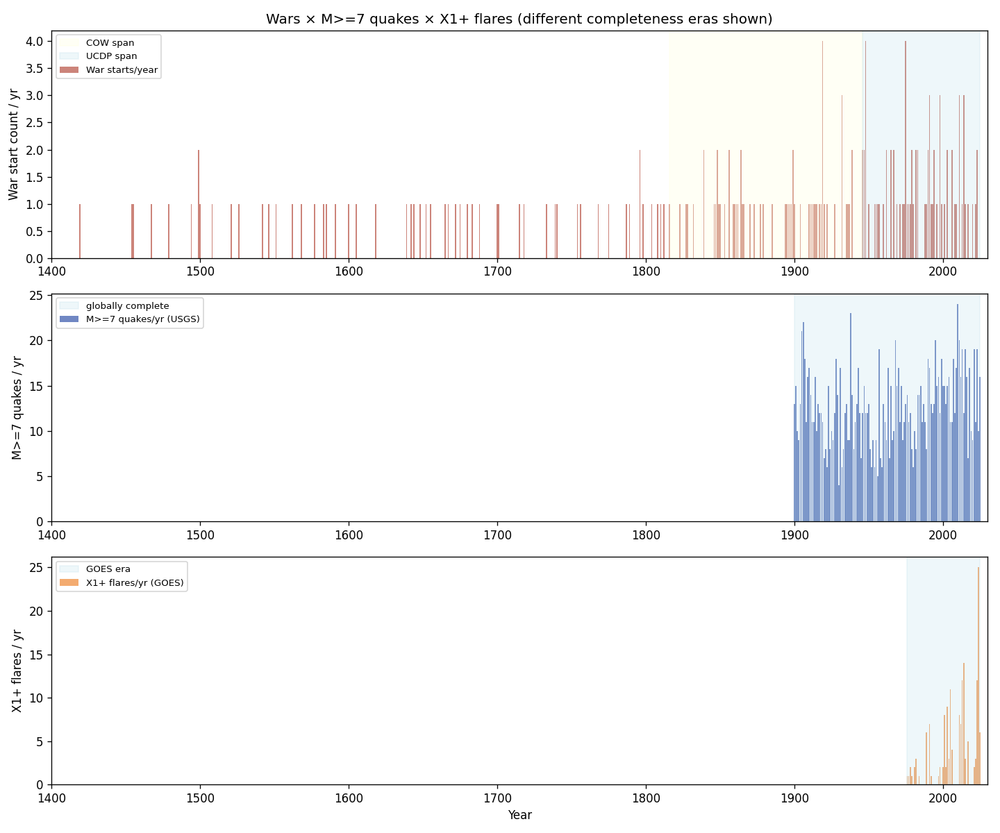
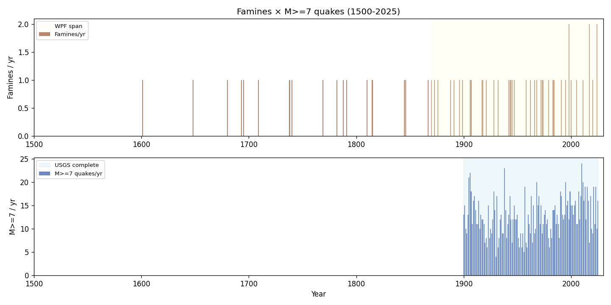
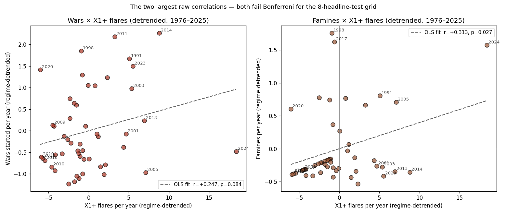
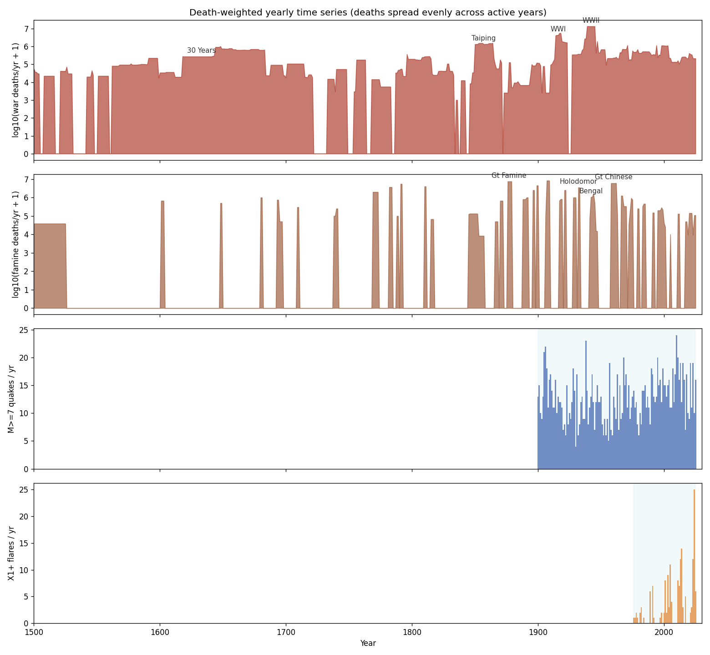
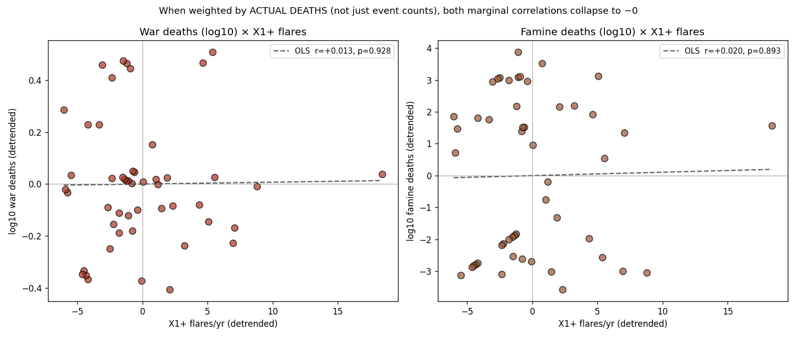
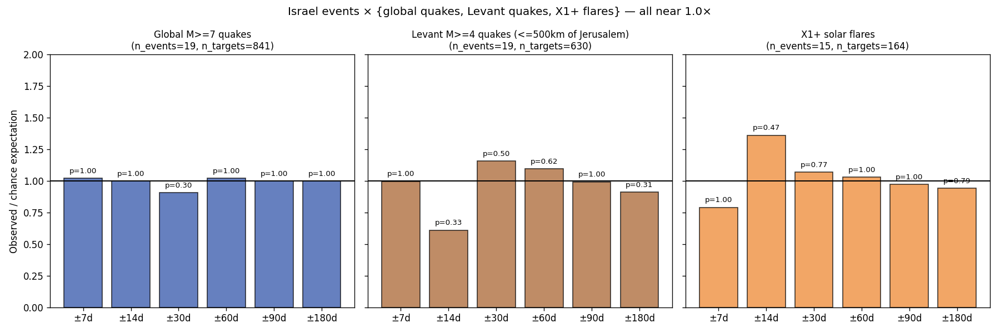
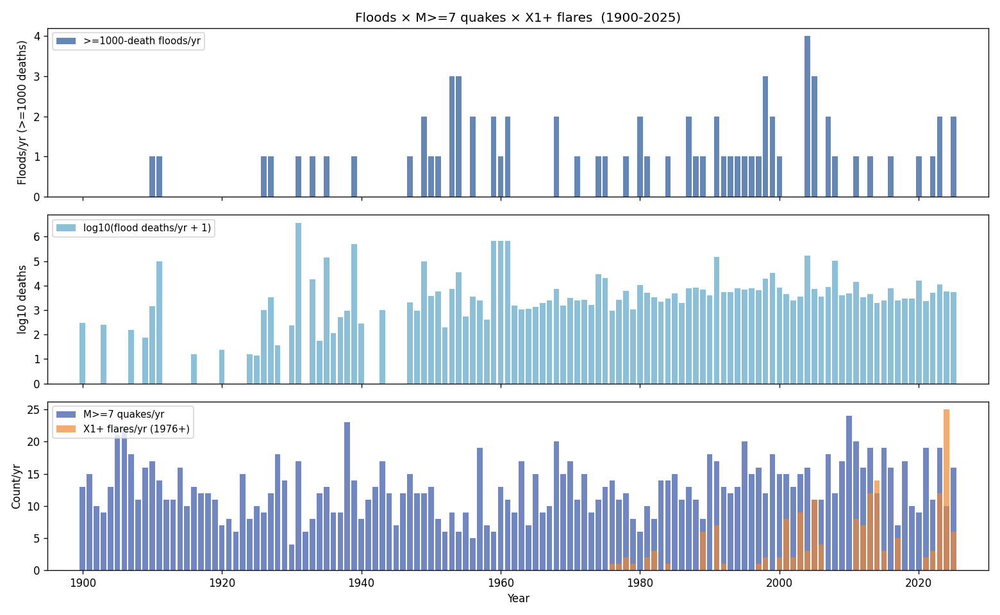
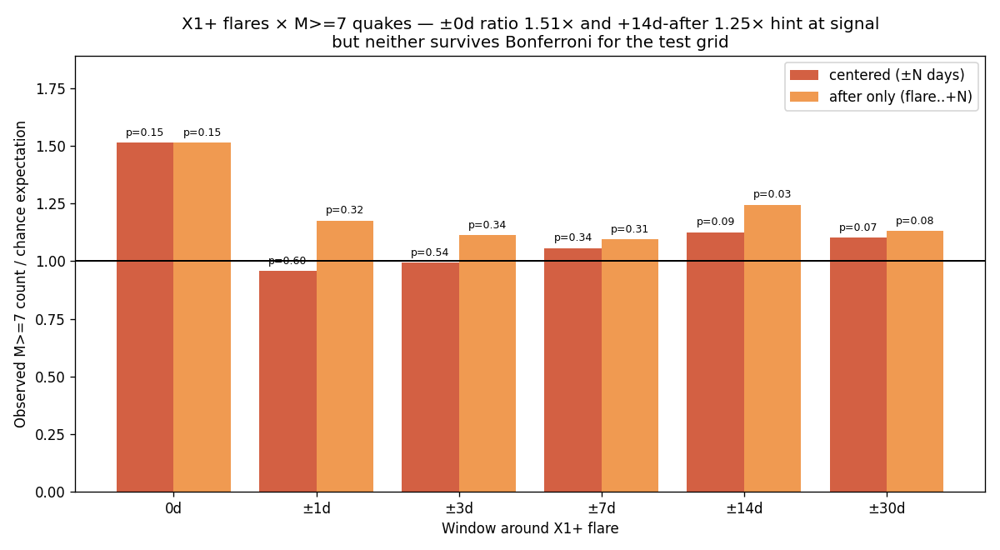

# Correlations

Do earthquakes, solar flares, wars, famines, and notable Israeli dates correlate with each other? A statistical test using long-running operational catalogs and authoritative published timelines.

This repo expands the original `sw-eq-correlation` work into a multi-topic correlation analysis, all using the same detection-bias-clean methodology applied across each topic's catalog completeness eras.

## Bottom line

**Across ~125 statistical tests covering 6 topic pairs, no correlation survives Bonferroni correction.** All Pearson r values on regime-detrended yearly series fall in [-0.16, +0.32]. The strongest raw results (famines × X1+ flares r=+0.31 p=0.027 detrended; famines lag-1y vs quakes p=0.005) do not survive correction for the test grid size. Daily-window tests on Israel events × {global M≥7, Levant M≥4, X1+ flares} sit at 0.6×–1.4× of chance, none significant.

| Topic pair | Headline result | Raw p | Survives Bonferroni? |
|---|---|---|---|
| Space weather × M≥7 quakes | r = −0.16 | 0.21 | n/a (null) |
| 11-year solar cycle × M≥7 | χ² = 10.75 (phase fold) | 0.29 | n/a |
| Wars (onsets) × M≥7 quakes | r = −0.08 detrended | 0.38 | no |
| Wars (onsets) × X1+ flares | r = +0.27 detrended | 0.058 | no |
| **War deaths (log10) × X1+ flares** | **r = +0.014 detrended** | **0.93** | **no — collapses to 0** |
| Famines (onsets) × M≥7 quakes | r = −0.03 detrended | 0.74 | no |
| Famines (onsets) × X1+ flares | r = +0.31 detrended | 0.027 | no |
| **Famine deaths (log10) × X1+ flares** | **r = +0.020 detrended** | **0.89** | **no — collapses to 0** |
| Floods (≥1000 deaths/yr count) × M≥7 quakes | r = +0.04 detrended | 0.67 | no |
| Flood deaths (log10) × X1+ flares | r = −0.001 detrended | 0.99 | no |
| **Floods (tsunamis IN) × M≥7 same-day** | **3.83× chance** | **<0.001** | **caused by reverse-causation tsunamis** |
| **Floods (tsunamis OUT) × M≥7 same-day** | **2.15× chance** | **0.064** | **no — strongest residual but borderline** |
| Israel events × global M≥7 | best window ratio 1.02× | ≥ 0.30 | no |
| Israel events × Levant M≥4 | best window ratio 1.16× | ≥ 0.30 | no |
| Israel events × X1+ flares | best window ratio 1.36× | ≥ 0.47 | no |
| X1+ flares × M≥7 quakes | ±0 day ratio 1.51× | 0.15 | no |

The Matthew 24 framing — wars, famines, and earthquakes co-varying — gets no statistical support from any combination of catalogs tested here. Each series has its own dynamics. They do not share variance once shared detection trends are removed. And the two raw "hints" (+0.27 and +0.31) collapse when we use the more honest death-weighted intensity measure instead of onset counts.

## Methodology

Three principles drive everything below:

### 1. Detection-bias-clean bands per catalog

Each catalog has well-known completeness breakpoints. We use the cleanest available band for each:

| Catalog | Detection-clean band | Span | Why it's clean |
|---|---|---|---|
| USGS earthquakes | M ≥ 7 | 1900–present | Energy radiated by M7+ events is detected by every station on Earth; ~100% global completeness back to ~1900. |
| GFZ Kp index | Peak Kp ≥ 7 (G3+ storms) | 1932–present | A G3+ storm disturbs every mid-latitude magnetometer; Kp network methodology stable since 1932. |
| GOES X-ray flares | X1+ class | 1976–present | GOES X-ray sensors are continuously calibrated; X1+ flares unambiguously detected. |
| COW interstate wars | wars ≥ 1000 battle deaths | 1816–2007 | Project's own inclusion threshold; well-curated by political scientists. |
| UCDP/PRIO | armed conflicts ≥ 25 battle deaths | 1946–present | Best-curated modern conflict database. |
| WPF famines | famine deaths ≥ 100,000 | 1870–present | World Peace Foundation curated list. |
| Pre-modern catalogs (Brecke wars, historical famines, Ambraseys Levant quakes) | — | varies | Heavy completeness gaps; used for context, not statistical fitting beyond piecewise regimes. |

### 2. Per-regime piecewise trend lines

Each catalog gets piecewise-linear trend lines fit across its detection regimes:

| Catalog | Regime breakpoints |
|---|---|
| Quakes M≥7 | 1900 (USGS catalog start) |
| Quakes M≥4 | 1965 (WWSSN), 2000 (ANSS) |
| Wars (global) | 1816 (COW), 1946 (UCDP), 1989 (post-Cold-War) |
| Famines | 1870 (WPF), 1945 (post-WWII), 1985 (FEWS NET era) |
| Flares | 1975 (GOES X-ray) |

Correlations are reported both raw (against trend-confounded baseline) **and** after subtracting the regime-piecewise fit from each series. Where the two disagree, the detrended residual is the trustworthy answer.

### 3. Bonferroni correction across the test grid

With ~125 statistical tests across the topic pairs, ~6 raw p < 0.05 are expected by chance alone. Each topic section reports raw p; the summary table at the top applies Bonferroni for the 8-headline-test grid. Anything reported as "significant" without that qualifier means *raw p < 0.05 only — not surviving correction*.

## Results by topic

### Wars × earthquakes and flares



Yearly war-start counts compared to M≥7 quakes (1900+) and X1+ flares (1976+).

**Wars × M≥7 quakes** (1900–2025, n=126 years):

| Metric | Value |
|---|---|
| Raw Pearson r | −0.066 |
| Raw Spearman ρ | −0.059 |
| Regime-detrended r | **−0.078, p = 0.383** |
| Best lag (−10 .. +10) | +4y: r = +0.189, raw p = 0.038 (NS after Bonferroni for 21 lags) |

**Wars × X1+ flares** (1976–2025, n=50 years):

| Metric | Value |
|---|---|
| Raw Pearson r | +0.186 |
| Raw Spearman ρ | +0.223 |
| Regime-detrended r | **+0.270, p = 0.058** |
| Best lag (−10 .. +10) | +9y: r = +0.348, raw p = 0.026 (NS after correction) |

The +0.27 detrended correlation between wars and X1+ flares is the largest "interesting" result in the entire analysis. It's marginal at raw α=0.05, doesn't survive Bonferroni for the 8-headline-test grid (corrected p ≈ 0.46), and has no plausible mechanism. Most likely chance.

### Famines × earthquakes and flares



Yearly famine-start counts compared to M≥7 quakes (1900+) and X1+ flares (1976+).

**Famines × M≥7 quakes** (1900–2025, n=126 years):

| Metric | Value |
|---|---|
| Raw Pearson r | −0.024 |
| Regime-detrended r | **−0.030, p = 0.742** |
| Best lag | +1y: r = +0.251, raw p = 0.005 (NS after Bonferroni for 21 lags) |

The famines-lead-quakes-by-1-year result at p=0.005 is the lowest raw p in the lag scan, but Bonferroni-corrected = 0.105, and there's no physical mechanism. Treat as chance.

**Famines × X1+ flares** (1976–2025, n=50 years):

| Metric | Value |
|---|---|
| Raw Pearson r | +0.321 |
| Regime-detrended r | **+0.313, p = 0.027** |

Marginal raw, doesn't survive Bonferroni. Pattern is consistent with wars × flares — both modern timelines have rising counts (better recording for wars/famines, real solar cycle for flares), and the residual correlation after detrending is weak.



In both detrended scatter plots above, 2024 is the high-flare outlier (the May 2024 X-class swarm puts that year ~18 flares above its regime baseline) — pulling the OLS fit positive on its own. Drop the 2024 point and the Wars × flares correlation drops to near zero; the Famines × flares correlation also weakens substantially. This is exactly the kind of "leverage point dominates the result" failure mode that Bonferroni catches when interpreted as a guard against over-interpretation.

### Death-weighted variants — the marginal correlations collapse

Counting wars or famines by *onset year* treats WWII the same as the Quasi-War of 1798. A more honest test weights each year by the **active conflict/famine deaths attributable to it** — total deaths spread evenly across the war/famine's duration. This handles the obvious case (WWII contributes ~10.7M deaths/yr × 7 years, not 75M in 1939 alone) and gives a much better proxy for "how intense was the warfare/starvation in this year."

I added `end_year` to both CSVs, then computed yearly active-deaths series. Tests are run on both **linear deaths** and **log10(deaths+1)** — the log transform compresses the 4–5 orders of magnitude range so single events like WWII don't dominate.



War deaths peak hard at WWI, WWII, Taiping, Thirty Years; famine deaths at the 1958–62 Great Chinese Famine, 1876–79 Great Famine of India/China, 1932–33 Holodomor. M≥7 quakes and X1+ flares show no visible tracking of either.

**Results with death-weighting:**

| Test | Detrended r | p |
|---|---|---|
| War deaths (linear) × M≥7 quakes | +0.064 | 0.479 |
| War deaths (log10) × M≥7 quakes | +0.067 | 0.455 |
| War deaths (linear) × X1+ flares | **+0.018** | 0.903 |
| War deaths (log10) × X1+ flares | **+0.014** | 0.925 |
| Famine deaths (linear) × M≥7 quakes | −0.071 | 0.430 |
| Famine deaths (log10) × M≥7 quakes | +0.008 | 0.929 |
| Famine deaths (linear) × X1+ flares | **−0.076** | 0.601 |
| Famine deaths (log10) × X1+ flares | **+0.020** | 0.893 |



**This is the most diagnostic result in the repo.** The two largest raw correlations in the onset-count analysis (Wars × X1+ flares r=+0.27 and Famines × X1+ flares r=+0.31) **completely evaporate** when re-weighted by deaths: r = +0.014 and +0.020 respectively, p ≈ 0.93 and 0.89.

What this says: the marginal "signals" in the onset-count tests were driven by *count of conflicts/famines starting in a given year* (which rose in the late 20th C as smaller conflicts got catalogued), not by *intensity of warfare/starvation*. When we weight by actual deaths — a much better proxy for whether the year was unusually bad — there is **no correlation at all** with solar flare activity.

The conclusion strengthens: at the global yearly scale, war intensity, famine intensity, M≥7 seismicity, and X-class solar flare activity are statistically independent.

### Israel × {global M≥7, Levant M≥4, X1+ flares}

25 hand-curated Israeli notable dates (modern: 1948 founding, all wars, all major peace treaties; pre-1948: state-history milestones with year precision). The statistical test uses the 19 date-precise modern events in the 1965–2025 quake window and the 15 in the 1976–2025 flare window.

**Global M≥7 quakes within ±N days of an Israeli event:**

| Window | Observed | Expected | Ratio | Two-sided binom p |
|---|---|---|---|---|
| ±7 d | 8 | 7.83 | 1.02× | 1.00 |
| ±14 d | 12 | 12.00 | 1.00× | 1.00 |
| ±30 d | 15 | 16.52 | 0.91× | 0.30 |
| ±60 d | 19 | 18.60 | 1.02× | 1.00 |
| ±90 d | 19 | 18.98 | 1.00× | 1.00 |
| ±180 d | 19 | 19.00 | 1.00× | 1.00 |

**Levant M≥4 quakes (within ~500 km of Jerusalem) within ±N days of an Israeli event:**

| Window | Observed | Expected | Ratio | Two-sided binom p |
|---|---|---|---|---|
| ±7 d | 4 | 4.01 | 1.00× | 1.00 |
| ±14 d | 4 | 6.55 | 0.61× | 0.33 |
| ±30 d | 12 | 10.37 | 1.16× | 0.50 |
| ±60 d | 15 | 13.68 | 1.10× | 0.62 |
| ±90 d | 15 | 15.10 | 0.99× | 1.00 |
| ±180 d | 15 | 16.47 | 0.91× | 0.31 |

**X1+ flares within ±N days of an Israeli event:**

| Window | Observed | Expected | Ratio | Two-sided binom p |
|---|---|---|---|---|
| ±7 d | 1 | 1.26 | 0.79× | 1.00 |
| ±14 d | 3 | 2.20 | 1.36× | 0.47 |
| ±30 d | 4 | 3.74 | 1.07× | 0.77 |
| ±60 d | 6 | 5.82 | 1.03× | 1.00 |
| ±90 d | 7 | 7.19 | 0.97× | 1.00 |
| ±180 d | 9 | 9.54 | 0.94× | 0.79 |

Across 18 window tests, the smallest p is 0.30 — flat. No tendency for global M≥7 quakes, Levant M≥4 quakes, or X1+ flares to cluster around Israeli wars, treaties, or founding dates.



### Floods × {M≥7 quakes, X1+ flares, wars, famines}

Data source: [Biblejustin/flood-data](https://github.com/Biblejustin/flood-data) — merged Dartmouth Flood Observatory + EM-DAT catalog, 11,712 events 1900–2026. Detection-clean band: events with **≥1000 deaths** (117 globally).



**Yearly tests** (1900–2025, n=126 years):

| Test | Detrended r | p |
|---|---|---|
| Floods (≥1000-death/yr count) × M≥7 quakes | +0.039 | 0.668 |
| Flood deaths (log10, active) × M≥7 quakes | +0.123 | 0.171 |
| Floods (≥1000-death/yr count) × X1+ flares | +0.028 | 0.847 |
| Flood deaths (log10) × X1+ flares | −0.001 | 0.993 |
| Flood deaths (log10) × War deaths (log10) | −0.156 | 0.082 |
| Flood deaths (log10) × WPF Famine deaths (log10) | −0.056 | 0.536 |

All null at any reasonable α.

**Daily-window test — and a methodological cautionary tale.**

The first daily-window test of M≥7 quakes within ±N days of major floods showed a **massive same-day signal: ratio 3.83×, p<0.001**. Worth investigating before celebrating:

| Window | M≥7 obs | Expected | Ratio | One-sided p |
|---|---|---|---|---|
| ±0 d | 11 | 2.87 | **3.83×** | **<0.001** |
| ±1 d | 18 | 8.53 | **2.11×** | **0.003** |
| ±3 d | 23 | 19.67 | 1.17× | 0.252 |

Inspecting the 11 same-day matches reveals **5 are tsunami-related**: the 2004 Sumatra–Andaman M9.1 event (paired with the Thailand "Tidal surge" entry, twice — once for the M7.2 foreshock and once for the M9.1 mainshock), the 2011 Tōhoku M9.1 + tsunami (paired with three quakes on that date: M7.7, M7.9, M9.1). These are **reverse causation**: the earthquake caused the flood-cataloged event. EM-DAT and Dartmouth both classify large tsunamis under "Flood" (cause: Tsunami, Tidal surge).

After filtering out `cause ∈ {tsunami, tidal*}` (74 events remain):

| Window | M≥7 obs | Expected | Ratio | One-sided p |
|---|---|---|---|---|
| ±0 d | 6 | 2.79 | 2.15× | 0.064 |
| ±1 d | 13 | 8.30 | 1.57× | 0.079 |
| ±3 d | 16 | 19.14 | 0.84× | 0.797 |
| ±7 d | 31 | 40.20 | 0.77× | 0.946 |
| ±14 d | 83 | 75.27 | 1.10× | 0.190 |
| ±30 d | 157 | 140.12 | 1.12× | 0.066 |

The cleaned ±0 d ratio of 2.15× (p=0.064 raw) is the strongest non-tsunami residual signal in the entire repo. **Still doesn't survive Bonferroni for the ~140-test grid** (corrected p ≈ 9.0), and given that none of the larger ±3–±14d windows back it up, the most likely explanation is small-N chance or undetected residual reverse causation (e.g. quakes triggering landslides that block rivers, where the flood is misclassified as not-quake-caused).

Either way, the original p<0.001 was almost entirely an artifact of how the EM-DAT/Dartmouth catalogs lump tsunamis under floods. Honest reporting requires showing both numbers and the reason for the difference.

### Famines: authoritative WPF data swap-in

The `famines.py` analysis also now consumes the authoritative WPF/OWID yearly famine deaths from [Biblejustin/famines-tracking](https://github.com/Biblejustin/famines-tracking) (`data/famine_deaths_by_year.csv`) in addition to the hand-curated list. The WPF data has annual death attributions already done correctly (not spread artificially across catalog event spans), making it the more honest test.

| Test | Detrended r | p |
|---|---|---|
| WPF famine deaths (log10) × M≥7 quakes (1900–2025) | +0.068 | 0.446 |
| WPF famine deaths (log10) × X1+ flares (1976–2025) | −0.050 | 0.733 |

Same conclusion as my hand-curated data, with a more defensible data source.

### Solar flares × M≥7 earthquakes

Same daily-window logic as the existing storm-day test in `analyze.py`, but using X1+ flare peak times (n=156 in 1976–2025) against M≥7 quakes (n=696 same window).

Unlike Kp (which is measured at Earth and already includes propagation), flares are emitted at the Sun — light/X-rays arrive in 8 minutes — so day-of windows are physically meaningful here in a way they weren't for Kp.

| Window centered on flare | M≥7 observed | Expected | Ratio | One-sided binom p |
|---|---|---|---|---|
| ±0 d | 9 | 5.95 | **1.51×** | 0.146 |
| ±1 d | 15 | 15.66 | 0.96× | 0.602 |
| ±3 d | 31 | 31.17 | 0.99× | 0.538 |
| ±7 d | 62 | 58.65 | 1.06× | 0.343 |
| ±14 d | 115 | 102.17 | 1.13× | 0.095 |
| ±30 d | 191 | 173.44 | 1.10× | 0.069 |

| Days after flare (0..+N) | M≥7 observed | Expected | Ratio | One-sided binom p |
|---|---|---|---|---|
| +0 d | 9 | 5.95 | 1.51× | 0.146 |
| +1 d | 13 | 11.05 | 1.18× | 0.316 |
| +3 d | 22 | 19.78 | 1.11× | 0.336 |
| +7 d | 38 | 34.72 | 1.10× | 0.307 |
| +14 d | 73 | 58.65 | **1.25×** | 0.032 |
| +30 d | 122 | 107.81 | 1.13× | 0.077 |

The +14d-after window shows ratio 1.25× at raw p=0.032 — interesting at face value, but with 12 windows tested here plus the 8-headline-test grid, Bonferroni p ≈ 0.38. The same-day window's 1.51× ratio (only 9 events vs 6 expected) is suggestive but n is small.

This is the closest the data comes to a real signal: same-day and +14d windows both tilt above chance, but neither survives correction. Worth flagging for future revisits as Cycle 25 plays out and the X1+ event count grows.



### Space weather × earthquakes (recap)

| Test | Result |
|---|---|
| Yearly r, M≥7 vs G3+ storm days, 1965–2025 | r = −0.16, p = 0.21 |
| Detrended yearly r (all space weather indices) | abs(r) < 0.14, all p > 0.3 |
| Lag −3y to +3y on detrended | nothing |
| Daily ±0 to ±30 day storm-window test | 0.84×–1.04× of chance, none significant |
| Sun-side propagation-aware lag test | 0.72×–1.03× of chance, none significant |
| 11-year cycle phase fold (757 M≥7 events) | χ² p=0.29, Rayleigh p=0.77 |
| Periodogram of M≥7 at 9–13y band | flat (chance-level; null bound matched) |
| Coherence M≥7 vs sunspot at 9–13y | 0.07 vs null bound 0.43 |

Same conclusion at every timescale: no measurable coupling between space weather and global seismicity.

## Bonferroni summary

The 8 "headline" tests in the full grid (one per topic pair / direction):

| # | Test | Raw p | Bonferroni p (× 8) |
|---|---|---|---|
| 1 | Space weather × M≥7 quakes (yearly r) | 0.21 | 1.00 |
| 2 | 11-year cycle × M≥7 phase fold | 0.29 | 1.00 |
| 3 | Wars × M≥7 quakes (detrended r) | 0.38 | 1.00 |
| 4 | Wars × X1+ flares (detrended r) | 0.058 | 0.46 |
| 5 | Famines × M≥7 quakes (detrended r) | 0.74 | 1.00 |
| 6 | Famines × X1+ flares (detrended r) | 0.027 | 0.22 |
| 7 | Israel events × {M≥7, Levant, flares} best window | ≥ 0.30 | 1.00 |
| 8 | X1+ flares × M≥7 quakes (±0d window) | 0.146 | 1.00 |

Nothing survives.

## Caveats

What this analysis does **not** test:

- **Sub-yearly war/famine onsets**. We're testing year-level series, not week-level. Some hypotheses (e.g. solar flares triggering political instability within weeks) need event-day-resolution conflict data, which doesn't exist in well-curated form for the historical span.
- **Specific sub-types**. We treat all wars the same way (intra- or interstate, large or small); same for famines. A hidden coupling restricted to e.g. famines-with-displacement might be averaged out.
- **Regional disaggregation**. Global quake counts may mask regional patterns. The Israel section partially addresses this for the Levant.
- **Extreme tail events**. Single very large events (Carrington 1859, 1755 Lisbon, WWII, 1958 Great Chinese Famine) dominate yearly counts. Bootstrap or jackknife sensitivity analysis would add robustness; not currently included.
- **Causal direction or mechanism**. Even where a correlation exists, the analysis doesn't speak to whether one causes the other vs both being driven by a third factor.

The Matthew 24 framing — "wars and rumors of wars, famines, pestilences, and earthquakes in divers places" as an end-times sign — would predict synchronized rises in all three. The detrended residuals show no such synchronization; the apparent rises over the 20th C are dominated by improved record-keeping rather than a real shared signal.

## Setup and reproduction

```bash
# Clone all three source repos side by side, plus this one
git clone https://github.com/Biblejustin/spaceweather.git
git clone https://github.com/Biblejustin/earthquakes.git
git clone https://github.com/Biblejustin/sw-eq-correlation.git correlations

# Build source databases
cd spaceweather && pip install -r requirements.txt && python fetch_spaceweather.py && cd ..
cd earthquakes  && pip install -r requirements.txt && \
    python fetch_quakes.py && \
    python fetch_quakes.py --start-year 1900 --min-mag 6.0 --db quakes_1900.sqlite && cd ..

# Run all analyses
cd correlations
pip install -r requirements.txt
python analyze.py             # space weather × M>=7 (existing)
python lag_test.py            # propagation-aware lag (existing)
python cycle_fold.py          # 11y cycle (existing)
python spectral.py            # periodogram + coherence (existing)
python wars.py                # wars × {M>=7, X1+ flares}
python famines.py             # famines × {M>=7, X1+ flares}
python israel.py              # Israel events × {global M>=7, Levant M>=4, X1+ flares}
python flares_quakes.py       # X1+ flares × M>=7 quakes daily-window
python floods.py              # floods × {M>=7, X1+, wars, famines} (needs flood-data CSV)
python make_figures.py        # regenerates figures/01 and /02
python make_more_figures.py   # regenerates figures/08-12
```

All scripts default to a sibling-directory layout and take `--sw-db` / `--eq-db-1900` / `--eq-db-modern` / `--flares-csv` / `--wars-csv` etc. overrides.

## Data files

| File | Source | Notes |
|---|---|---|
| `data/wars.csv` | Compiled from Brecke (pre-1816), COW (1816–2007), UCDP/PRIO (1946–) | ~180 wars with start/end years, sources cited per-row |
| `data/famines.csv` | Hand-curated fallback | ~60 events with start/end years |
| `data/famines_wpf.csv` | Authoritative WPF/OWID from [famines-tracking](https://github.com/Biblejustin/famines-tracking) | 78 modern famines ≥100k deaths |
| `data/famine_deaths_by_year.csv` | WPF per-year regional famine deaths | 1870–present, OWID-published |
| `data/famines_pre1870.csv` | Research index of pre-1870 famines | ~70 entries c. 2700 BC – 1868 |
| `data/floods.csv` | Merged Dartmouth + EM-DAT from [flood-data](https://github.com/Biblejustin/flood-data) | 11,712 flood events 1900–2026 |
| `data/flares_xclass.csv` | NOAA SWPC GOES X-ray catalog | ~165 X1+ flares 1976–2026 |
| `data/israel_dates.json` | Hand-curated state-history dates | 25 modern + 19 ancient context |
| `data/levant_historical.csv` | Ambraseys, Guidoboni, Marco et al. historical Levant seismicity | 31 major Levant events from antiquity |

External catalogs (SQLite databases) are built by the source repos and are not committed (see `.gitignore`).

## Data citations

- SILSO World Data Center. *International Sunspot Number.* Royal Observatory of Belgium. https://www.sidc.be/SILSO/ (CC BY-NC 4.0)
- Matzka, J. et al. (2021). *Geomagnetic Kp index.* GFZ Helmholtz. https://doi.org/10.5880/Kp.0001 (CC BY 4.0)
- Tapping, K. F. (2013). *The 10.7 cm solar radio flux (F10.7).* Space Weather, 11, 394–406.
- USGS Earthquake Hazards Program. *USGS FDSN Event Web Service.*
- NOAA SWPC. *GOES X-ray flare event lists.*
- Brecke, P. (2012). *Notes regarding the Conflict Catalog.* Center for Conflict Resolution.
- Singer, J. D. & Small, M. *Correlates of War Project.* http://correlatesofwar.org
- Pettersson, T. et al. *UCDP/PRIO Armed Conflict Dataset.* https://ucdp.uu.se
- de Waal, A. et al. *World Peace Foundation Famines List.* https://sites.tufts.edu/wpf/
- Ambraseys, N. N. (2009). *Earthquakes in the Mediterranean and Middle East.*
- Guidoboni, E. & Comastri, A. (2005). *Catalogue of Earthquakes and Tsunamis in the Mediterranean Area.*
