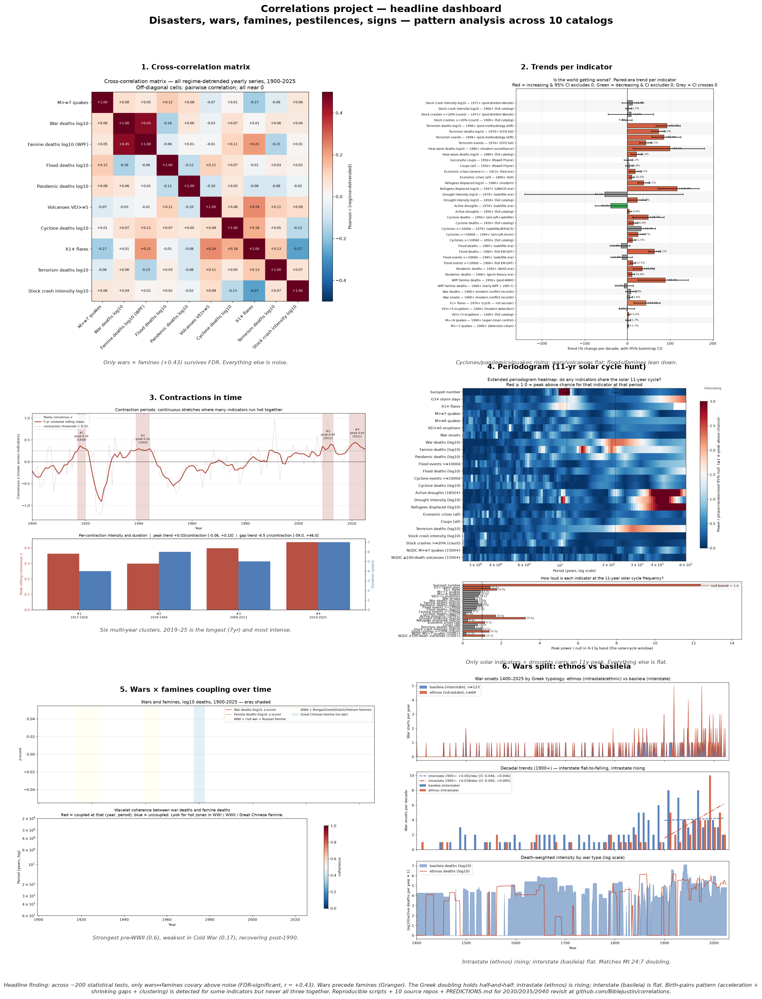

# Correlations

Research hub for Biblejustin's disaster, conflict, food, space-weather and Israel datasets. Biblical themes guide questions; measurements do not establish prophetic fulfillment.

September 2026 integrity update: explicit source coverage, corrected allocation and event matching, dependence-aware statistical tests, and regional monitoring. Older headlines about universal independence, drought's solar cycle, proven Granger causation and escalating composite contractions are superseded by these outputs. Git history preserves earlier versions.

## Start here

- [Climate, seasonal flu and purchasing-power report](results/monitoring/extensions/extensions_report.md): NOAA ocean indices, separate adjustment tests, prior-season positivity and exact food/wage trends.
- [Complete eclipse and Jerusalem-visibility monitor](data/celestial_monitoring/data/eclipses/report.md): global solar/lunar catalog, local circumstances, altitude and duration.
- [Trade and food-price report](results/monitoring/trade/trade_report.md): Suez, Bab el-Mandeb and Hormuz transit, official exchange rates, cereal-import dependence and all 192 planned comparisons.
- [WFP and IPC source recovery](SOURCE_RECOVERY.md): audited archives, missing baseline observations and required geographic evidence.
- [Regional monitoring report](results/monitoring/monitoring_report.md): conflict, food stress, affordability, displacement, respiratory surveillance, religious freedom and Israel water.
- [Monitoring definitions and sources](MONITORING.md): exact measures, geography, cadence, coverage and future validation rules.
- [Methodology](METHODOLOGY.md): missingness, selected catalogs, allocation assumptions and statistical families.
- [Remaining work](BACKLOG.md): observations still unavailable and deeper research extensions.
- [Operations and verification](OPERATIONS.md): shared Make entrypoints, exact dependency checks, clean-install evidence and CI.
- [Frozen historical predictions](PREDICTIONS.md): original hypotheses retained. Current scorecards are diagnostics, not independent validation of a refitted model.

## What changed in the evidence

**Israeli wheat deserves follow-up.** Wheat yield per hectare and total rainfall remain associated over 1991–2023 after linear time adjustment: r ≈ +0.558, HAC-adjusted q ≈ 0.000014 across the 30-test decomposition family. Harvested area has little association. Rain × era interaction does not establish a changed yield response. Irrigated-land adjustment uses only 17 reported years and gives weaker evidence; the source covariate covers all crops. These are historical exploratory results. See [crop/rain feeder](https://github.com/Biblejustin/israel-rain-agriculture) and copied [analysis results](data/israel_monitoring/israel-rain-agriculture/results).

**Current water and heat monitoring now extends through 2025.** Separate CRU-CY4.10 national data track rainfall, seasonal temperature, potential evapotranspiration and wet days. Rain year 2025 received 218.8 mm, 53.6% of its fixed 1991–2020 baseline. The original CCKP rain aggregation differs materially, so the current monitor cannot silently extend the frozen wheat model. [Climate results and overlap checks](data/israel_monitoring/israel-rain-agriculture/results/climate_monitor.md) retain the product distinction and future-validation requirements.

**New displacement flows are monitored directly.** IDMC annual exports provide displacement movements and year-end stocks through 2025. Repeated movements by one person are possible; the figures are not inferred from refugee-stock changes. The existing regional lag-test family remains unchanged until cause and territorial comparability are verified.

**Climate controls and seasonal/affordability trends are now monitored.** The new sensitivity has no global BH discoveries; Ukraine conflict/refugee-stock change passes HAC correction but fails the original block-permutation correction. This is method-dependent exploratory evidence. Seasonal flu retains missing weeks and minimum tested counts. Exact food/wage trends work; no aggregate basket has the required 2015–2019 coverage. [Definitions and complete outputs](results/monitoring/extensions/extensions_report.md).

**Shipping and currency pathways now have explicit tests.** The separate 192-fit family has six estimable Yemen exchange-rate fits and no BH-corrected survivor in the initial September 6 snapshot. Shipping comparisons lack 60 contiguous compatible months; that is insufficient evidence, not evidence of no relationship. Official FX can differ from market rates, and chokepoint transit does not measure grain shipments. Cereal dependence retains its full three-year windows. [Coverage and all results](results/monitoring/trade/trade_report.md).

**IPC history now preserves 384 observations.** Full supplied national history replaces the latest-only adapter. Six ambiguous or internally inconsistent periods are quarantined with original rows; prior snapshots remain archived. Reports identify retained old assessments. Geographic comparability remains unverified, so this expansion does not unlock additional country lag tests. See [history and revision rules](MONITORING.md).

**War–famine association remains era-dependent.** The full-span matrix gives r ≈ +0.452 (1900–2023), surviving its 45-pair block-null sensitivity family. This does not establish the same relationship in every era or establish causation. See exported windows, sample sizes and q-values.

**Broad significance claims shrink after repair.** The 30-test Granger family and searched chain family have no corrected survivors in this snapshot. Wavelet calculations now use 6,200 finite cells on observed overlap; coherence is descriptive and edge-masked. In the 24-indicator 9–13-year spectral family, only sunspots survive the fitted AR(1) sensitivity null. A missing or nonsignificant result does not prove independence.

**Composite currently unavailable.** Fixed baseline/domain weights expose insufficient flood-mortality and drought-affected baseline observations. The analysis emits explicit missing scores and reasons. It cannot presently support escalating-contraction headlines.

**Complete eclipses now have a separate denominator.** The NASA extension retains 913 solar/lunar events for 1900–2100, including future predictions, with fixed Jerusalem visibility, altitude and above-horizon phase durations. It preserves contact dates across midnight and labels modeled UT1 explicitly. The selected historical CSV remains separate. [Coverage, upcoming events and validation](data/celestial_monitoring/data/eclipses/report.md).

**Catalog definitions matter.** Flood counts and dates now use one canonical event resolver; unknown mortality remains unknown. Duration totals are allocated over original event lifetimes before slicing a window. Cyclone Sidr's false 2003 duplicate is removed. Selected eclipse/flare/disaster lists remain incomplete research catalogs.

The [flood linkage audit](data/diagnostics/flood_linkage/manifest.json) applies 11 reviewed block splits using source hashes, stable record identities and retained publisher evidence. Canonical catalog units increase from 7,434 to 7,445; counts at ≥100 reported deaths are unchanged. It still flags 781 groups for review, preserving 3,379 member records as evidence. All 11,712 raw records remain unchanged. [Before/after sensitivity](data/diagnostics/flood_linkage/correction_sensitivity.csv) preserves the legacy comparison. These catalog identities do not establish physically independent disasters; the unflagged subset remains incomplete.



Machine-readable evidence accompanies revised figures: [matrix](figures/18_cross_correlation_results.csv), [pattern tests](figures/20_pattern_results.json), [composite coverage](figures/22_composite.json), [spectral family](figures/23_periodogram_results.csv), [wavelet](figures/25_wavelet_results.json), [chains](figures/26_chain_results.csv), [Granger](figures/28_granger_results.csv), [regional drought sensitivity](figures/29_regional_drought_results.csv). File names and methods are versioned alongside code.

## Project layout

Clone all repositories as siblings beneath one directory. Use only the Biblejustin GitHub account.

| Repository | Input |
|---|---|
| [earthquakes](https://github.com/Biblejustin/earthquakes) | USGS event times/magnitudes; NOAA significant-event context |
| [spaceweather](https://github.com/Biblejustin/spaceweather) | SILSO and GFZ measurements |
| [famines-tracking](https://github.com/Biblejustin/famines-tracking) | WPF/OWID famine records |
| [flood-data](https://github.com/Biblejustin/flood-data) | Linked flood sources |
| [pandemics-tracking](https://github.com/Biblejustin/pandemics-tracking) | Historical selected pandemic records |
| [volcanic-eruptions](https://github.com/Biblejustin/volcanic-eruptions) | Selected eruption catalog |
| [tropical-cyclones](https://github.com/Biblejustin/tropical-cyclones) | Selected high-mortality cyclones |
| [droughts-tracking](https://github.com/Biblejustin/droughts-tracking) | Drought events and human impacts |
| [astronomical-signs](https://github.com/Biblejustin/astronomical-signs) | Complete solar/lunar eclipse monitor and fixed Jerusalem visibility; separate selected historical events |
| [israel-pressure-disasters](https://github.com/Biblejustin/israel-pressure-disasters) | Coded diplomatic events, NOAA/FEMA controls |
| [israel-rain-agriculture](https://github.com/Biblejustin/israel-rain-agriculture) | Historical rainfall, crop area/yield, irrigation and Kinneret |

New authoritative regional feeds live under `data/monitoring`; adapters and definitions live under `monitoring`. `sync_feeders.py` copies an explicit list of feeder-owned files and records hashes. Central merged flood, war, flare, NOAA and UCDP catalogs have separate ownership.

## Run

```bash
make bootstrap                 # Python 3.13; pinned runtime and test dependencies
make test                      # isolated fixture tests
make refresh                   # full fetch, synchronization and analysis; local outputs
make local                     # same analyses using existing local source data
make publish                   # full refresh followed by guarded publication
```

The full legacy suite also needs local earthquake/space-weather SQLite databases. Fetch them using their feeder instructions. Missing databases fail clearly and cannot be silently replaced with empty databases.

```bash
make catalogs SOURCES="quakes ngdc"     # selected fetch diagnostics; no analysis or publication
make PY=/absolute/path/to/venv/bin/python local
```

Publication requires clean starting trees, active Biblejustin authentication, verified Biblejustin remotes, and every stage passing. Default runs leave local changes for review. No implicit pulls or destructive artifact reverts. Logs remain in `logs/`; stage status is written to `results/analysis_run.json` and `results/refresh_run.json`. Failed refreshes preserve previous good source snapshots and stop publication; sources may have different latest observation dates.

Make targets share `weekly_update.py` and `run_suite.py`; every operational Make target verifies the runtime first, and full/fetch-only refreshes run regression tests before downloads. Fetch-only evidence is stored separately in `results/fetch_run.json`. The legacy shell wrapper remains available for callers supplying the shared runtime.

`--dry-run` still updates local generated files; it suppresses commits, pushes and advancement of the successful-source snapshot. Targeted analyses: `python run_suite.py --scripts wavelet granger`.
